# Credit Card Enterprise System - Complete Architecture Documentation

## 🏗️ System Overview

The Credit Card Enterprise System is a comprehensive financial services platform built with modern microservices architecture, featuring AI-powered chatbot interfaces, Model Context Protocol (MCP) integration, and enterprise-grade security. The system enables seamless credit card operations, fraud management, transaction processing, and customer service through multiple interfaces.

## 📋 Table of Contents

1. [System Architecture](#system-architecture)
2. [MCP (Model Context Protocol) Integration](#mcp-model-context-protocol-integration)
3. [Chatbot & NLP Components](#chatbot--nlp-components)
4. [Backend API Services](#backend-api-services)
5. [Sequence Diagrams](#sequence-diagrams)
6. [Code Structure Analysis](#code-structure-analysis)
7. [Security Architecture](#security-architecture)
8. [Deployment Architecture](#deployment-architecture)

---

## 🏢 System Architecture

### High-Level Architecture Overview

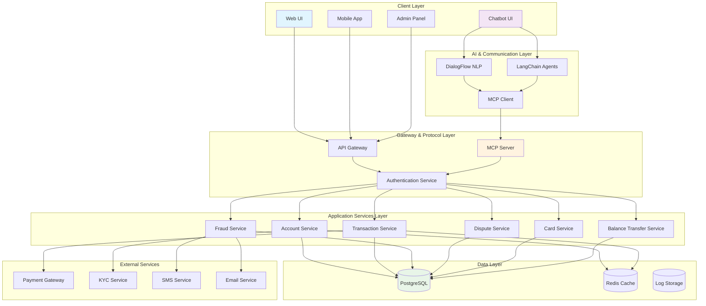

### Component Architecture Details

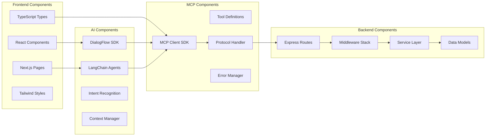

---

## 🔗 MCP (Model Context Protocol) Integration

### MCP Architecture Overview

The Model Context Protocol serves as the communication bridge between AI components and backend services, providing a standardized way for AI agents to interact with enterprise systems.

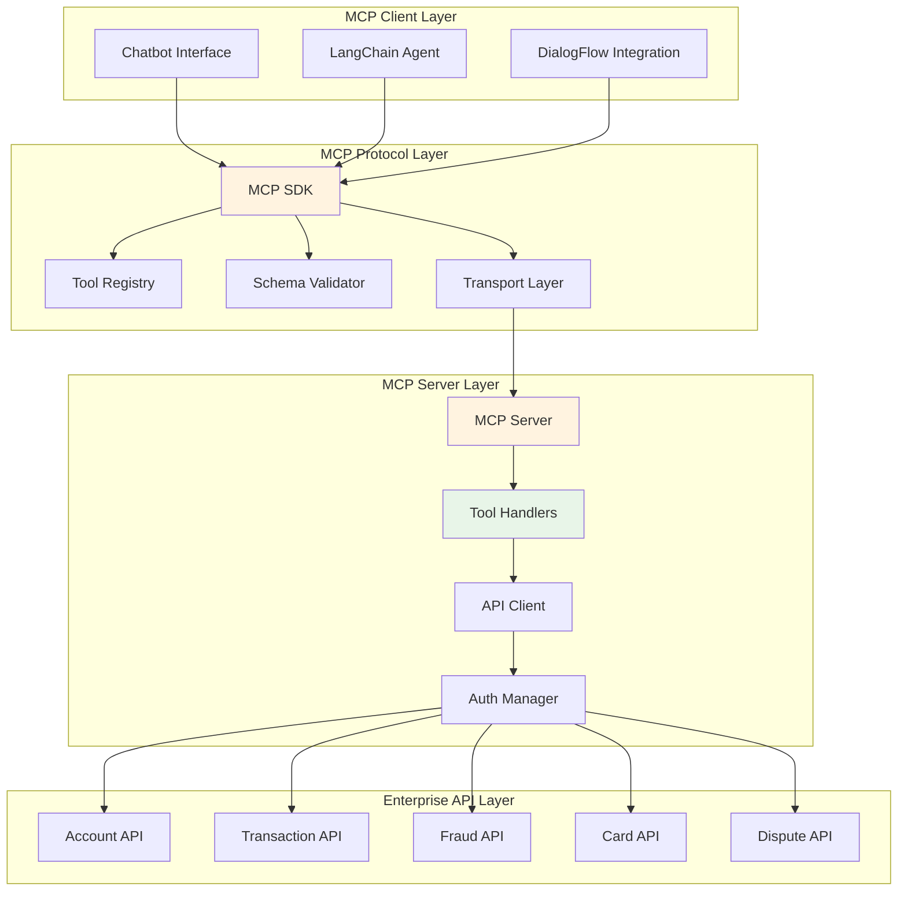

### MCP Tool Registry

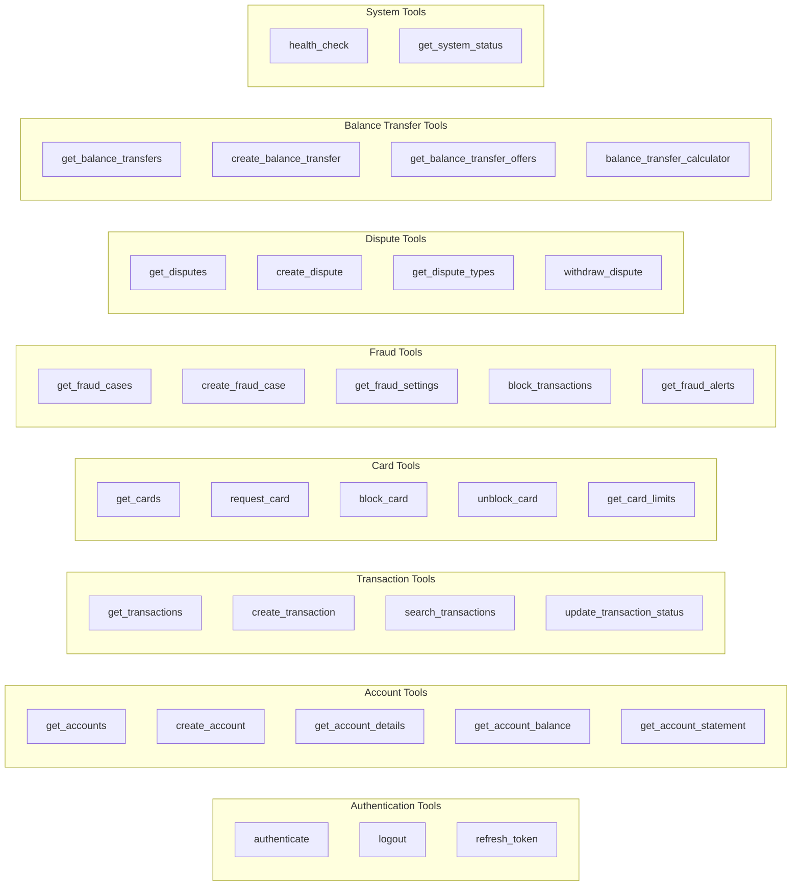

---

## 🤖 Chatbot & NLP Components

### DialogFlow NLP Integration

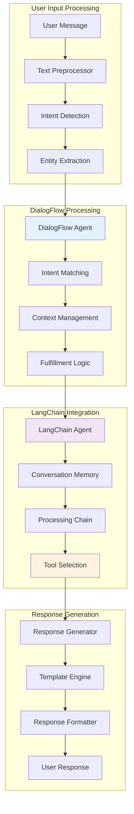

### Intent Classification System

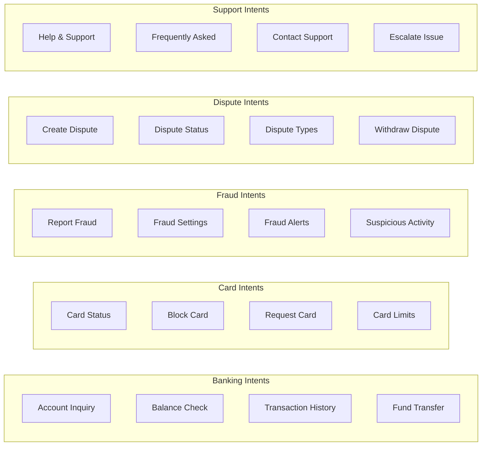

---

## 🔧 Backend API Services

### Service Architecture

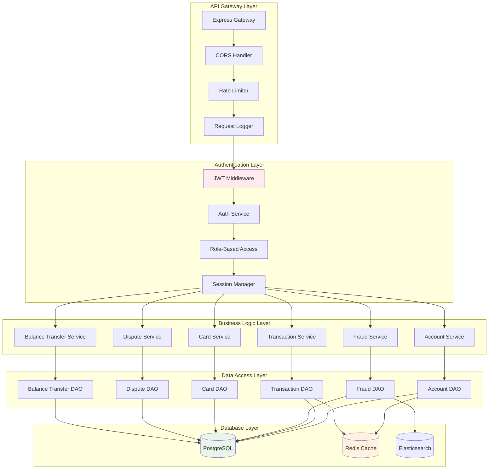

### API Endpoint Structure

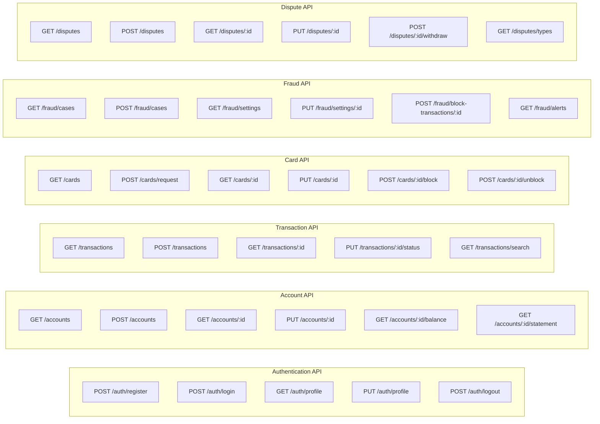

---

## 📊 Sequence Diagrams

### User Authentication Flow

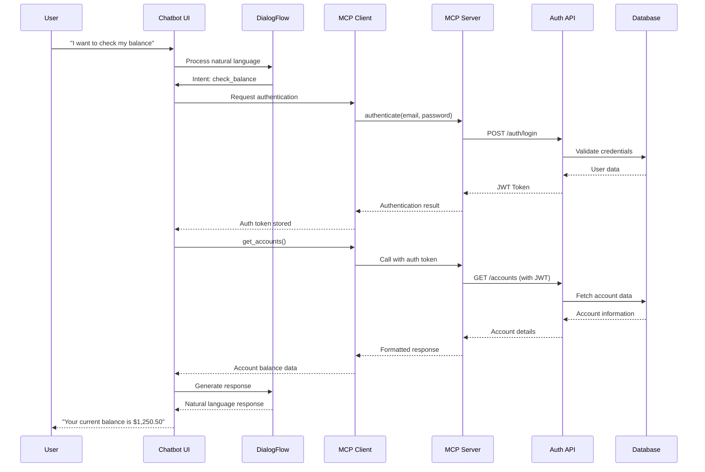

### Transaction Processing Flow

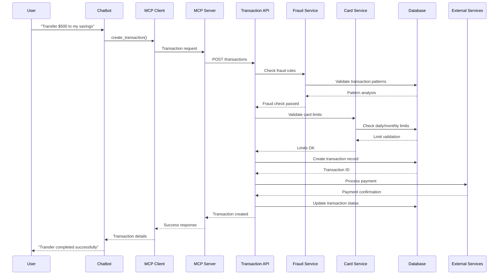

### Fraud Detection Flow

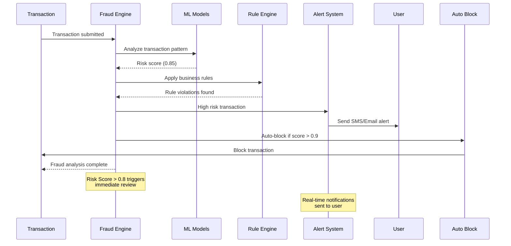

### Dispute Resolution Flow

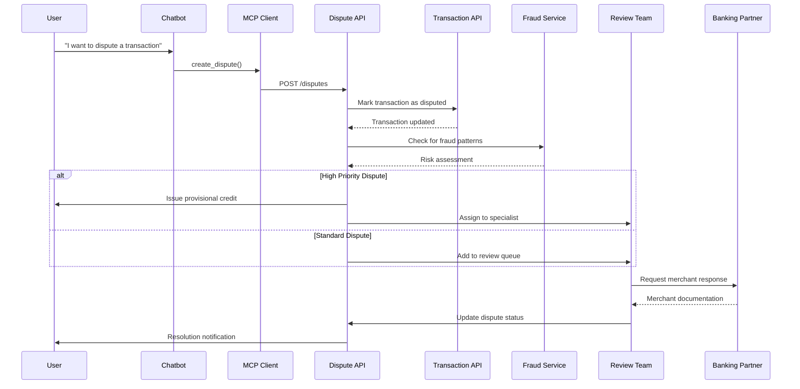

---

## 💻 Code Structure Analysis

### Project Architecture

```
credit-card-enterprise/
├── packages/
│   ├── backend/                 # Express.js Backend API
│   │   ├── routes/             # API Routes
│   │   │   ├── auth.js         # Authentication endpoints
│   │   │   ├── accounts.js     # Account management
│   │   │   ├── transactions.js # Transaction processing
│   │   │   ├── cards.js        # Card operations
│   │   │   ├── fraud.js        # Fraud management
│   │   │   └── disputes.js     # Dispute handling
│   │   ├── middleware/         # Express middleware
│   │   │   ├── auth.js         # JWT authentication
│   │   │   └── validation.js   # Request validation
│   │   ├── models/             # Data models
│   │   ├── services/           # Business logic
│   │   └── utils/              # Helper functions
│   │
│   ├── chatbot-ui/             # React Chatbot Interface
│   │   ├── src/
│   │   │   ├── components/     # React components
│   │   │   │   ├── Chat/       # Chat interface
│   │   │   │   ├── Auth/       # Authentication
│   │   │   │   └── Banking/    # Banking operations
│   │   │   ├── services/       # API services
│   │   │   │   ├── mcp.js      # MCP client
│   │   │   │   ├── dialogflow.js # DialogFlow integration
│   │   │   │   └── langchain.js  # LangChain agents
│   │   │   ├── hooks/          # Custom React hooks
│   │   │   └── utils/          # Utility functions
│   │   └── pages/              # Next.js pages
│   │
│   ├── web-ui/                 # Main Web Application
│   └── shared/                 # Shared utilities and types
│
├── mcp-server.js               # MCP Server implementation
├── docker-compose.yml          # Docker orchestration
└── config/                     # Configuration files
```

### Key Components Deep Dive

#### 1. MCP Server Implementation

```javascript
// mcp-server.js - Core MCP Server
class CreditCardMCPServer {
  constructor() {
    this.server = new Server({
      name: 'credit-card-enterprise-mcp',
      version: '1.0.0',
    }, {
      capabilities: { tools: {} }
    });
    
    this.apiBaseUrl = process.env.API_BASE_URL || 'http://localhost:3000/api/v1';
    this.authToken = null;
    
    this.setupToolHandlers();
    this.setupErrorHandling();
  }

  // Tool registration and handling
  setupToolHandlers() {
    this.server.setRequestHandler(ListToolsRequestSchema, async () => {
      return { tools: this.getToolDefinitions() };
    });

    this.server.setRequestHandler(CallToolRequestSchema, async (request) => {
      return await this.handleToolCall(request.params.name, request.params.arguments);
    });
  }

  // Authentication handler
  async handleAuthentication(args) {
    const response = await axios.post(`${this.apiBaseUrl}/auth/login`, {
      email: args.email,
      password: args.password
    });
    
    this.authToken = response.data.token;
    return {
      content: [{
        type: 'text',
        text: `Authentication successful. Token expires in ${response.data.expiresIn}`
      }]
    };
  }

  // Account operations
  async handleGetAccounts(args) {
    const params = new URLSearchParams(args);
    const response = await axios.get(`${this.apiBaseUrl}/accounts?${params}`, {
      headers: { Authorization: `Bearer ${this.authToken}` }
    });
    
    return {
      content: [{
        type: 'text',
        text: JSON.stringify(response.data, null, 2)
      }]
    };
  }
}
```

#### 2. Chatbot Integration

```typescript
// src/services/mcp.js - MCP Client Integration
export class MCPClient {
  private client: Client;
  private transport: StdioClientTransport;

  constructor() {
    this.transport = new StdioClientTransport({
      command: 'node',
      args: ['../../mcp-server.js']
    });
    this.client = new Client({ name: 'chatbot-client', version: '1.0.0' }, {
      capabilities: {}
    });
  }

  async connect(): Promise<void> {
    await this.client.connect(this.transport);
  }

  async authenticate(email: string, password: string): Promise<any> {
    return await this.client.request({
      method: 'tools/call',
      params: {
        name: 'authenticate',
        arguments: { email, password }
      }
    });
  }

  async getAccounts(filters?: AccountFilters): Promise<any> {
    return await this.client.request({
      method: 'tools/call',
      params: {
        name: 'get_accounts',
        arguments: filters || {}
      }
    });
  }
}
```

#### 3. DialogFlow Integration

```typescript
// src/services/dialogflow.js - NLP Processing
export class DialogFlowService {
  private sessionClient: SessionsClient;
  private projectId: string;
  private sessionId: string;

  constructor() {
    this.sessionClient = new SessionsClient();
    this.projectId = process.env.DIALOGFLOW_PROJECT_ID!;
    this.sessionId = crypto.randomUUID();
  }

  async detectIntent(query: string, languageCode: string = 'en'): Promise<IntentResult> {
    const sessionPath = this.sessionClient.projectAgentSessionPath(
      this.projectId,
      this.sessionId
    );

    const request = {
      session: sessionPath,
      queryInput: {
        text: {
          text: query,
          languageCode: languageCode,
        },
      },
    };

    const [response] = await this.sessionClient.detectIntent(request);
    
    return {
      intentName: response.queryResult?.intent?.displayName || 'Default',
      parameters: response.queryResult?.parameters || {},
      fulfillmentText: response.queryResult?.fulfillmentText || '',
      confidence: response.queryResult?.intentDetectionConfidence || 0
    };
  }

  async processWithContext(query: string, context: ConversationContext): Promise<ProcessedResult> {
    const intentResult = await this.detectIntent(query);
    
    // Map intents to MCP tool calls
    const toolMapping = {
      'check.balance': 'get_accounts',
      'transfer.money': 'create_transaction',
      'block.card': 'block_card',
      'report.fraud': 'create_fraud_case',
      'dispute.transaction': 'create_dispute'
    };

    const toolName = toolMapping[intentResult.intentName];
    if (toolName) {
      return {
        ...intentResult,
        mcpTool: toolName,
        parameters: this.extractParameters(intentResult.parameters)
      };
    }

    return intentResult;
  }
}
```

#### 4. LangChain Agent Implementation

```typescript
// src/services/langchain.js - Conversation Management
export class BankingAgent {
  private agent: AgentExecutor;
  private memory: ConversationBufferMemory;
  private mcpClient: MCPClient;

  constructor(mcpClient: MCPClient) {
    this.mcpClient = mcpClient;
    this.memory = new ConversationBufferMemory({
      memoryKey: "chat_history",
      returnMessages: true
    });

    this.agent = this.createAgent();
  }

  private createAgent(): AgentExecutor {
    const tools = [
      new Tool({
        name: "get_account_balance",
        description: "Get current account balance for the user",
        func: async (input: string) => {
          const accounts = await this.mcpClient.getAccounts();
          return JSON.stringify(accounts);
        }
      }),
      new Tool({
        name: "transfer_funds",
        description: "Transfer money between accounts",
        func: async (input: string) => {
          const params = JSON.parse(input);
          return await this.mcpClient.createTransaction(params);
        }
      }),
      new Tool({
        name: "report_fraud",
        description: "Report fraudulent activity",
        func: async (input: string) => {
          const params = JSON.parse(input);
          return await this.mcpClient.createFraudCase(params);
        }
      })
    ];

    const prompt = ChatPromptTemplate.fromTemplate(`
      You are a helpful banking assistant. Use the available tools to help users with their banking needs.
      
      Previous conversation:
      {chat_history}
      
      Current request: {input}
      
      Available tools: {tools}
      
      Thought: {agent_scratchpad}
    `);

    return AgentExecutor.fromAgentAndTools({
      agent: new OpenAIFunctionsAgent({
        llm: new ChatOpenAI({ temperature: 0 }),
        tools,
        prompt
      }),
      tools,
      memory: this.memory,
      verbose: true
    });
  }

  async processMessage(message: string): Promise<AgentResponse> {
    try {
      const result = await this.agent.call({
        input: message,
        chat_history: this.memory.chatHistory
      });

      return {
        response: result.output,
        toolsUsed: result.intermediateSteps?.map(step => step.action.tool) || [],
        confidence: 0.9
      };
    } catch (error) {
      return {
        response: "I apologize, but I encountered an error processing your request. Please try again.",
        toolsUsed: [],
        confidence: 0.0,
        error: error.message
      };
    }
  }
}
```

#### 5. Backend API Service Layer

```javascript
// routes/accounts.js - Account Management API
const express = require('express');
const { auth } = require('../middleware/auth');
const { validateRequest } = require('../middleware/validation');
const accountService = require('../services/accountService');

const router = express.Router();

// GET /api/v1/accounts - Retrieve user accounts
router.get('/', auth, async (req, res) => {
  try {
    const { page, limit, status, accountType } = req.query;
    const filters = { page, limit, status, accountType };
    
    const accounts = await accountService.getUserAccounts(
      req.user.userId, 
      filters
    );
    
    res.json({
      message: 'Accounts retrieved successfully',
      data: accounts.data,
      pagination: accounts.pagination
    });
  } catch (error) {
    res.status(500).json({
      error: 'Failed to retrieve accounts',
      message: error.message
    });
  }
});

// POST /api/v1/accounts - Create new account
router.post('/', auth, validateRequest(createAccountSchema), async (req, res) => {
  try {
    const accountData = {
      ...req.body,
      userId: req.user.userId
    };
    
    const newAccount = await accountService.createAccount(accountData);
    
    res.status(201).json({
      message: 'Account created successfully',
      account: newAccount
    });
  } catch (error) {
    res.status(500).json({
      error: 'Failed to create account',
      message: error.message
    });
  }
});
```

---

## 🔒 Security Architecture

### Security Layer Implementation

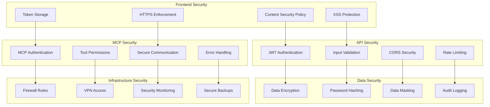

### Authentication & Authorization Flow

```mermaid
graph LR
    subgraph "Client Authentication"
        LOGIN[User Login]
        VALIDATE[Credential Validation]
        JWT_GEN[JWT Generation]
        TOKEN_STORE[Token Storage]
    end
    
    subgraph "API Authorization"
        TOKEN_CHECK[Token Verification]
        ROLE_CHECK[Role Validation]
        PERMISSION[Permission Check]
        ACCESS_GRANT[Access Granted]
    end
    
    subgraph "MCP Authorization"
        MCP_TOKEN[MCP Token Check]
        TOOL_AUTH[Tool Authorization]
        RATE_CHECK[Rate Limiting]
        AUDIT_LOG[Audit Logging]
    end
    
    LOGIN --> VALIDATE
    VALIDATE --> JWT_GEN
    JWT_GEN --> TOKEN_STORE
    
    TOKEN_STORE --> TOKEN_CHECK
    TOKEN_CHECK --> ROLE_CHECK
    ROLE_CHECK --> PERMISSION
    PERMISSION --> ACCESS_GRANT
    
    ACCESS_GRANT --> MCP_TOKEN
    MCP_TOKEN --> TOOL_AUTH
    TOOL_AUTH --> RATE_CHECK
    RATE_CHECK --> AUDIT_LOG
```

---

## 🚀 Deployment Architecture

### Container Architecture

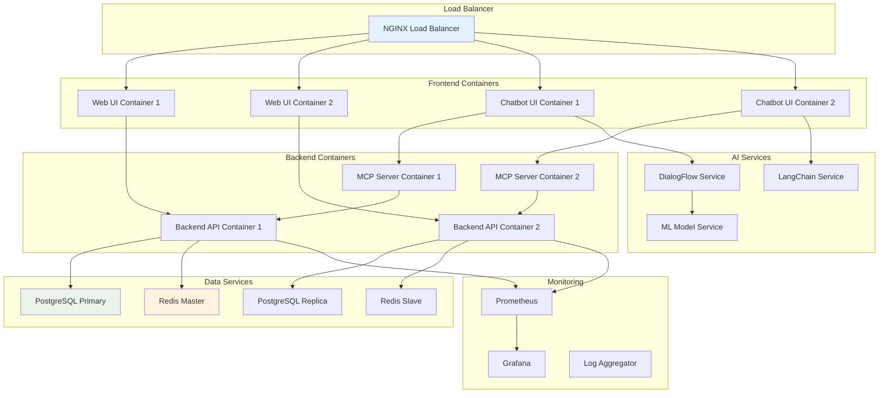

### Microservices Deployment

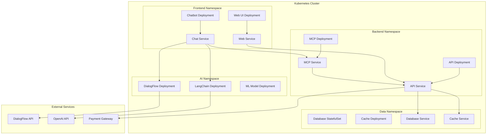

---

## 📈 Performance & Monitoring

### System Monitoring Dashboard

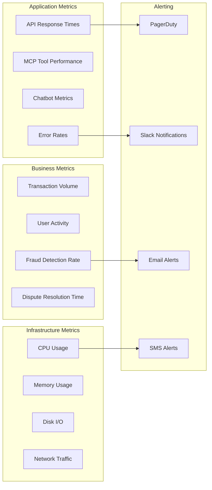

## 🎯 Conclusion

This Credit Card Enterprise System represents a comprehensive financial services platform that leverages modern technologies including:

- **Model Context Protocol (MCP)** for seamless AI-to-API communication
- **DialogFlow NLP** for natural language understanding
- **LangChain Agents** for intelligent conversation management
- **Microservices Architecture** for scalability and maintainability
- **Enterprise Security** with JWT authentication and fraud protection
- **Real-time Processing** for transactions and fraud detection

The system is designed to handle enterprise-scale operations while providing an intuitive chatbot interface for customers and comprehensive APIs for developers. The modular architecture ensures easy maintenance, scaling, and feature additions.

### Key Benefits:

1. **Unified Communication**: MCP provides a standardized way for AI components to interact with backend services
2. **Natural Language Interface**: Users can perform complex banking operations through conversational AI
3. **Real-time Fraud Protection**: Advanced fraud detection with automatic blocking and alerting
4. **Scalable Architecture**: Microservices design supports horizontal scaling
5. **Developer Friendly**: Comprehensive APIs with detailed documentation and testing tools
6. **Security First**: Multi-layered security architecture protecting sensitive financial data

The system is production-ready and can be deployed using the provided Docker configurations and Kubernetes manifests for enterprise environments.
