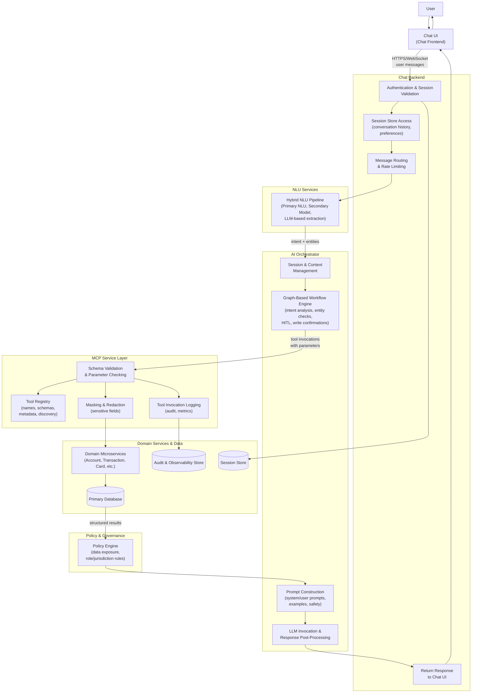
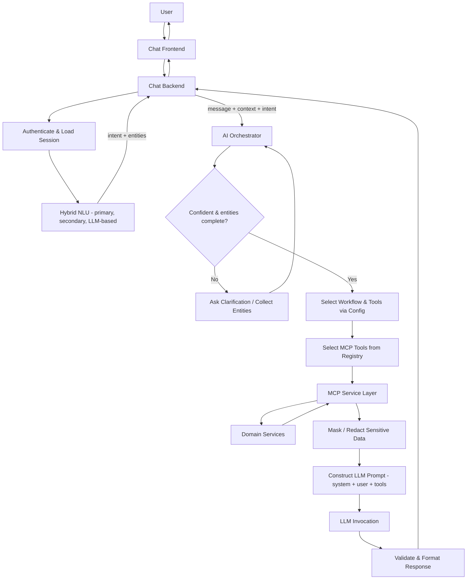

FIG 1

```mermaid
flowchart TD
  U[User] --> UI["Chat UI<br/>(Chat Frontend)"]

  subgraph Backend["Chat Backend"]
    AUTH["Authentication & Session<br/>Validation"]
    SESS["Session Store Access<br/>(conversation history,<br/>preferences)"]
    ROUTE["Message Routing<br/>& Rate Limiting"]
    OUT["Return Response<br/>to Chat UI"]
  end

  subgraph NLULayer["NLU Services"]
    NLU_PIPE["Hybrid NLU Pipeline<br/>(Primary NLU, Secondary Model,<br/>LLM-based extraction)"]
  end

  subgraph Orchestrator["AI Orchestrator"]
    CTX["Session & Context<br/>Management"]
    WF["Graph-Based Workflow Engine<br/>(intent analysis, entity checks,<br/>HITL, write confirmations)"]
    PROMPTS["Prompt Construction<br/>(system/user prompts,<br/>examples, safety)"]
    RESP["LLM Invocation &<br/>Response Post-Processing"]
  end

  subgraph MCP["MCP Service Layer"]
    VAL["Schema Validation<br/>& Parameter Checking"]
    REG["Tool Registry<br/>(names, schemas,<br/>metadata, discovery)"]
    MASK["Masking & Redaction<br/>(sensitive fields)"]
    LOG["Tool Invocation Logging<br/>(audit, metrics)"]
  end

  subgraph Domain["Domain Services & Data"]
    SVC["Domain Microservices<br/>(Account, Transaction, Card, etc.)"]
    DB[("Primary Database")]
    SSTORE[("Session Store")]
    AUDIT[("Audit & Observability Store")]
  end

  subgraph PolicyLayer["Policy & Governance"]
    POLICY["Policy Engine<br/>(data exposure,<br/>role/jurisdiction rules)"]
  end

  UI -->|HTTPS/WebSocket<br/>user messages| AUTH
  AUTH --> SESS
  AUTH --> SSTORE
  SESS --> ROUTE
  ROUTE --> NLU_PIPE
  NLU_PIPE -->|intent + entities| CTX
  CTX --> WF

  WF -->|tool invocations<br/>with parameters| VAL
  VAL --> REG
  VAL --> MASK
  VAL --> LOG
  LOG --> AUDIT

  MASK --> SVC
  SVC --> DB
  DB -->|structured results| POLICY

  POLICY --> PROMPTS
  PROMPTS --> RESP
  RESP --> OUT
  OUT --> UI
  UI --> U
```

```mermaid
flowchart TD
  U[User] --> UI2[Chat Frontend]
  UI2 --> BE2[Chat Backend]
  BE2 --> AUTH2[Authenticate & Load Session]

  AUTH2 --> NLU2["Hybrid NLU - primary, secondary, LLM-based"]
  NLU2 -->|intent + entities| BE2
  BE2 -->|message + context + intent| ORCH2[AI Orchestrator]

  ORCH2 --> DEC2{"Confident & entities complete?"}

  DEC2 -->|No| CLAR2["Ask Clarification / Collect Entities"]
  CLAR2 --> ORCH2

  DEC2 -->|Yes| WF2["Select Workflow & Tools via Config"]
  WF2 --> TOOLSEL2["Select MCP Tools from Registry"]
  TOOLSEL2 --> MCP2[MCP Service Layer]
  MCP2 --> DOM2[Domain Services]
  DOM2 --> MCP2

  MCP2 --> MASK2["Mask / Redact Sensitive Data"]
  MASK2 --> PROMPT2["Construct LLM Prompt - system + user + tools"]
  PROMPT2 --> LLM2["LLM Invocation"]
  LLM2 --> RESP2["Validate & Format Response"]
  RESP2 --> BE2
  BE2 --> UI2
  UI2 --> U
```