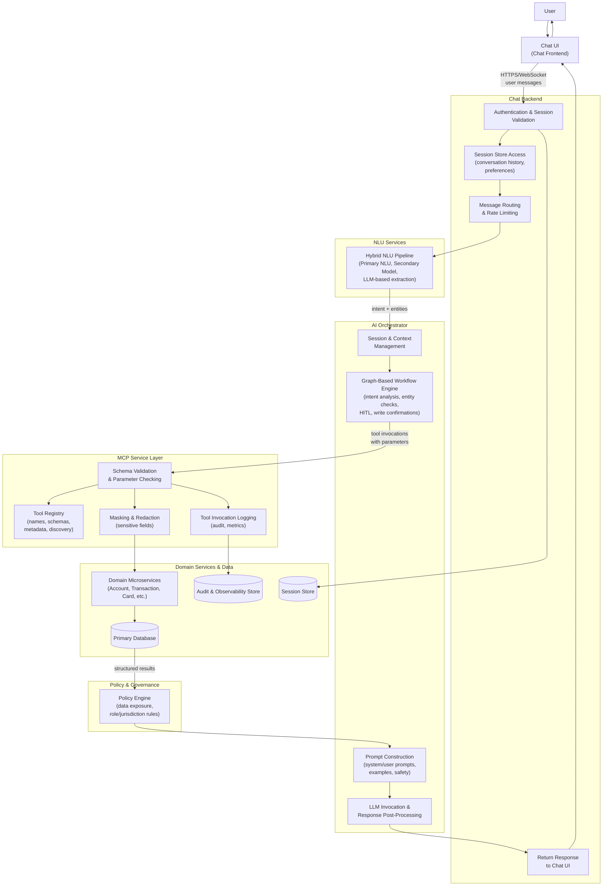
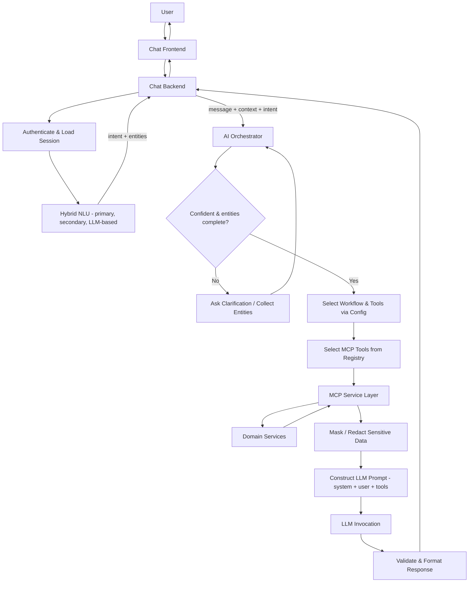
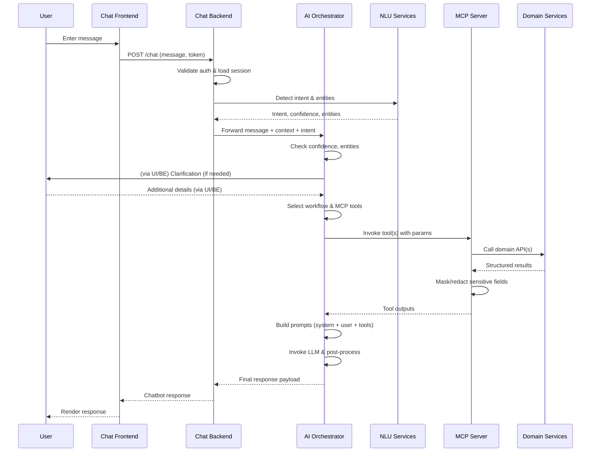
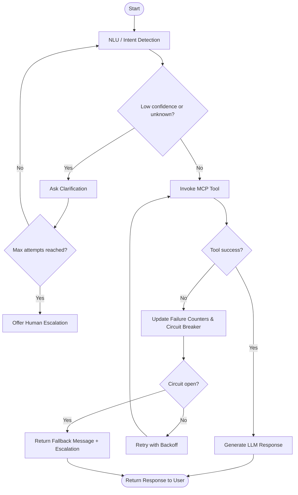
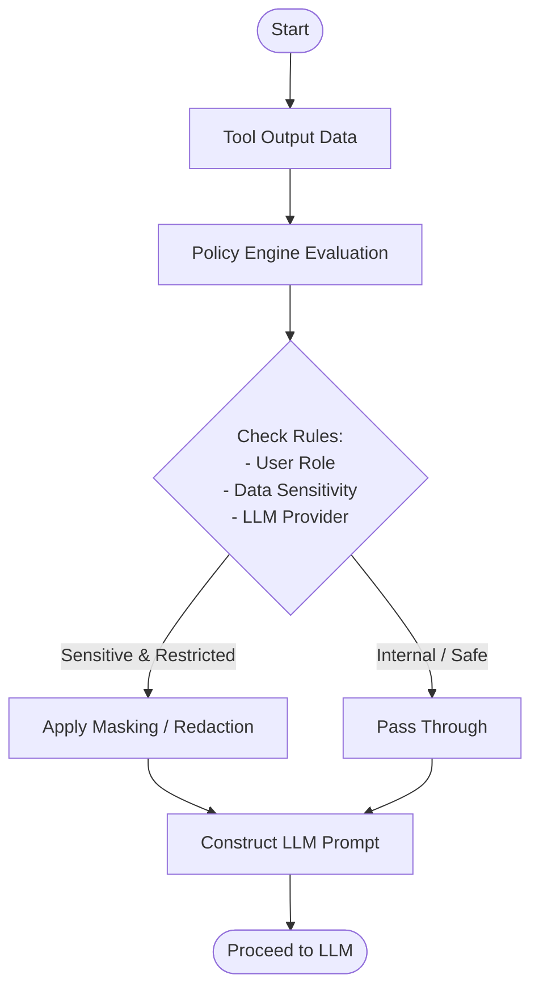

FIG 1

- **FIG. 3** is a sequence diagram illustrating interactions among the chat frontend, chat backend, AI orchestrator, NLU service, MCP server, and domain microservices for a sample request.

%%

%%

- **FIG. 5** is a flow diagram illustrating error handling, circuit breaking, and human escalation for low-confidence or failed tool executions.

- **FIG. 6** is a flow diagram illustrating the policy engine workflow for data governance, masking, and redaction of sensitive tool outputs.

