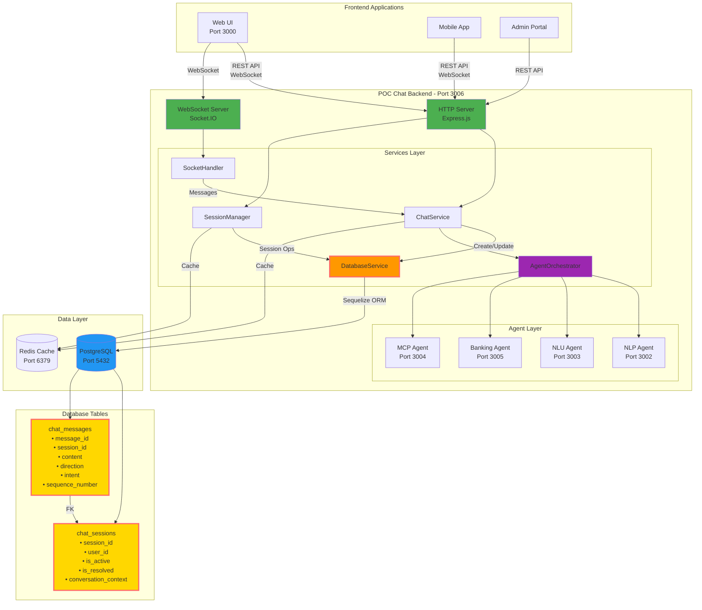
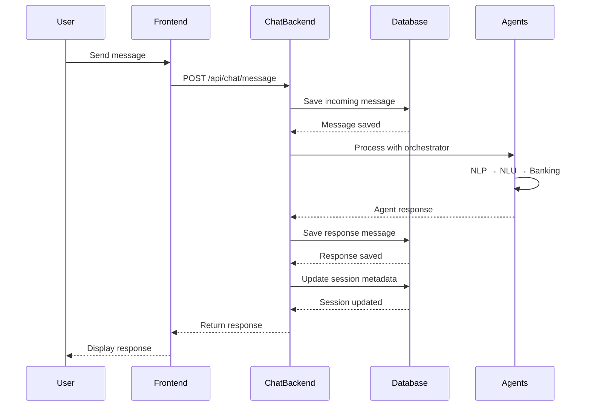
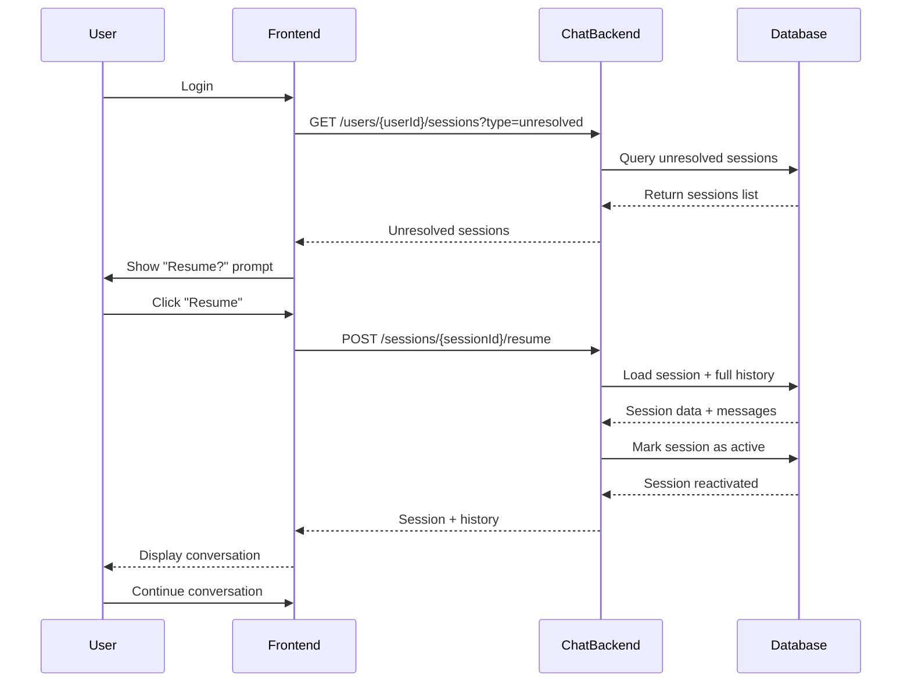
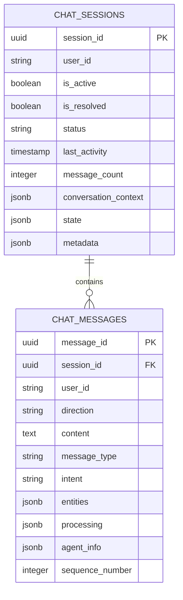
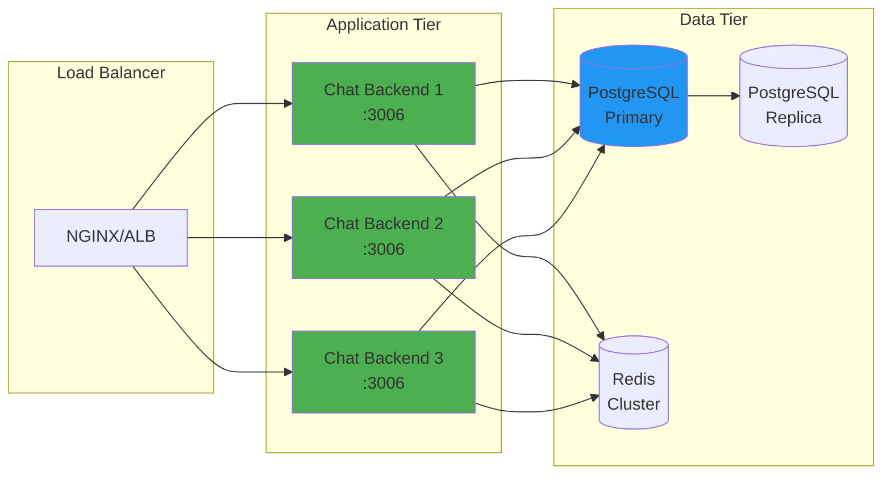

# POC Chat Backend - Architecture Diagram



## Component Responsibilities

### HTTP/WebSocket Servers
- **HTTP Server (Express)**: RESTful API endpoints
- **WebSocket Server (Socket.IO)**: Real-time bidirectional communication

### Services Layer

#### ChatService
- Message processing and routing
- Conversation history management
- **Database persistence integration** ✨
- Event emission for real-time updates

#### SessionManager
- User session lifecycle management
- Session state tracking
- Authentication validation
- Session cleanup

#### DatabaseService ✨ NEW
- **PostgreSQL integration via Sequelize**
- Session CRUD operations
- Message persistence
- **Resume session functionality**
- History retrieval with pagination

#### AgentOrchestrator
- Multi-agent coordination
- Request routing to appropriate agents
- Response aggregation
- Fallback handling

#### SocketHandler
- WebSocket connection management
- Event handling and routing
- Client state management

### Agent Layer
- **NLP Agent**: Natural language processing
- **NLU Agent**: Intent and entity extraction
- **Banking Agent**: Banking operations
- **MCP Agent**: Model Context Protocol handling

### Data Layer

#### PostgreSQL Database ✨ NEW
- **chat_sessions**: Complete session information
- **chat_messages**: Full message history
- ACID compliance
- Indexed for performance

#### Redis Cache (Optional)
- Session caching
- Rate limiting
- Temporary data storage

## Data Flow: Message Processing



## Data Flow: Session Resume



## Database Schema Relationships



## Technology Stack

| Layer | Technology | Purpose |
|-------|-----------|---------|
| **Web Framework** | Express.js 4.x | HTTP server |
| **Real-time** | Socket.IO 4.x | WebSocket communication |
| **Database** | PostgreSQL 12+ | Persistent storage |
| **ORM** | Sequelize 6.x | Database operations |
| **Cache** | Redis 4.x | Session caching |
| **Auth** | JWT | Authentication |
| **Security** | Helmet.js | Security headers |
| **Logging** | Winston 3.x | Structured logging |
| **Validation** | Joi | Input validation |

## Deployment Architecture



## Key Features Highlighted

### ✨ New Database Features
1. **Full Persistence**: All sessions and messages saved to PostgreSQL
2. **Session Resume**: Load and continue unresolved conversations
3. **Rich Metadata**: Context, state, and processing info stored
4. **Performance**: Optimized indexes for fast queries
5. **Reliability**: ACID compliance and data integrity

### 🔒 Security Features
1. JWT Authentication on all endpoints
2. Rate limiting (60 msg/min)
3. SQL injection prevention (Sequelize ORM)
4. Input validation and sanitization
5. Secure password hashing (bcrypt)

### 📊 Monitoring & Health
1. Database connectivity checks
2. Health endpoint with detailed status
3. Structured logging (Winston)
4. Error tracking and alerting
5. Performance metrics

## File Structure

```
poc-chat-backend/
├── database/
│   ├── config.js              ✨ Database configuration
│   ├── index.js               ✨ Sequelize setup
│   └── models/
│       ├── ChatSession.js     ✨ Session model
│       └── ChatMessage.js     ✨ Message model
├── services/
│   ├── chatService.js         🔄 Updated with DB
│   ├── sessionManager.js
│   ├── agentOrchestrator.js
│   ├── socketHandler.js
│   ├── databaseService.js     ✨ New DB service
│   └── logger.js
├── routes/
│   ├── api.js                 🔄 Added resume endpoints
│   ├── auth.js
│   └── health.js
├── openapi.yaml               ✨ API documentation
├── README.md                  ✨ Complete guide
├── IMPLEMENTATION-SUMMARY.md  ✨ This summary
├── QUICK-REFERENCE.md         ✨ Quick reference
├── test-integration.sh        ✨ Test script
├── server.js
├── package.json               🔄 Added DB deps
└── .env                       🔄 Added DB config

✨ = New files
🔄 = Updated files
```

---

**Architecture Status**: ✅ Complete and Production-Ready  
**Database Integration**: ✅ Fully Implemented  
**Documentation**: ✅ Comprehensive  
**Testing**: ✅ Automated Tests Included
