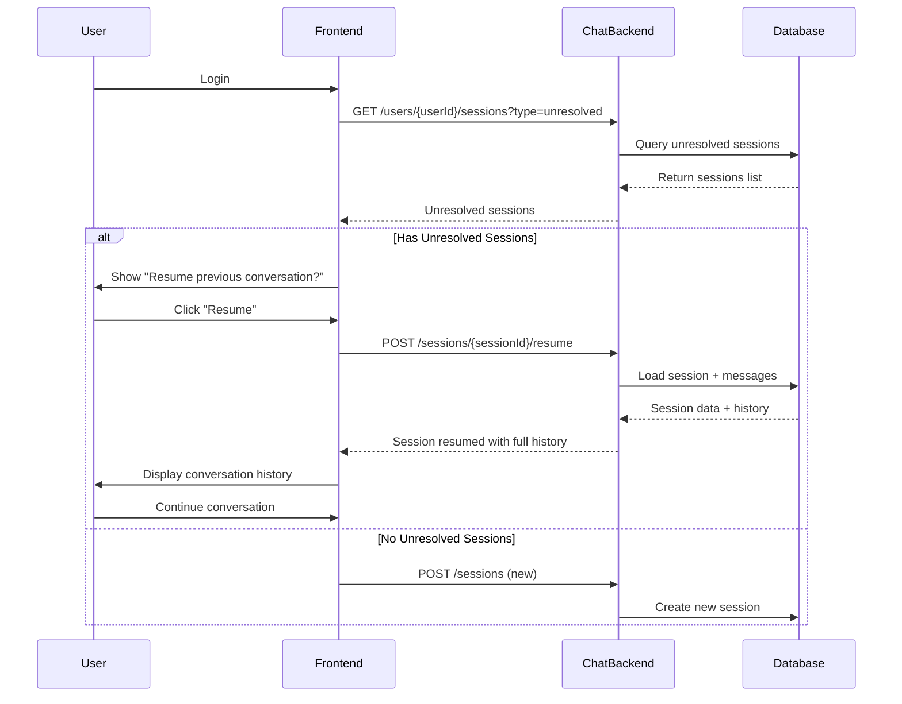

# POC Chat Backend - Complete Implementation Guide

## Overview

The POC Chat Backend is a real-time chat processing service with agent orchestration, database persistence, and session management. It provides comprehensive chat history storage and the ability to resume unresolved conversations.

## Features

✅ **Fully Implemented:**
- ✅ Real-time messaging via WebSocket (Socket.IO)
- ✅ Multi-agent orchestration (NLP, NLU, Banking, MCP)
- ✅ JWT Authentication
- ✅ Rate limiting and security
- ✅ **Database persistence for chat history** (PostgreSQL + Sequelize)
- ✅ **Session management with database storage**
- ✅ **Resume unresolved chat sessions**
- ✅ **Comprehensive OpenAPI 3.0 documentation**
- ✅ RESTful API endpoints
- ✅ WebSocket event handlers
- ✅ Graceful shutdown and error handling

## Architecture

```
┌─────────────────────────────────────────────────────────┐
│                  POC Chat Backend (3006)                │
├─────────────────────────────────────────────────────────┤
│                                                         │
│  ┌──────────────┐  ┌──────────────┐  ┌─────────────┐ │
│  │ ChatService  │  │SessionManager│  │DatabaseSvc  │ │
│  └──────────────┘  └──────────────┘  └─────────────┘ │
│         │                  │                 │         │
│  ┌──────────────────────────────────────────────────┐ │
│  │        Agent Orchestrator                        │ │
│  │  ┌──────┐ ┌──────┐ ┌────────┐ ┌──────┐         │ │
│  │  │ NLP  │ │ NLU  │ │Banking │ │ MCP  │         │ │
│  │  └──────┘ └──────┘ └────────┘ └──────┘         │ │
│  └──────────────────────────────────────────────────┘ │
│                                                         │
└─────────────────────────────────────────────────────────┘
                          │
                          ▼
              ┌───────────────────────┐
              │  PostgreSQL Database  │
              │                       │
              │  - chat_sessions      │
              │  - chat_messages      │
              └───────────────────────┘
```

## Database Schema

### chat_sessions Table
Stores all chat sessions with full context and state.

```sql
CREATE TABLE chat_sessions (
    session_id UUID PRIMARY KEY,
    user_id VARCHAR(100) NOT NULL,
    is_active BOOLEAN DEFAULT TRUE,
    is_resolved BOOLEAN DEFAULT FALSE,
    status VARCHAR(50) DEFAULT 'active',
    last_activity TIMESTAMP NOT NULL,
    expires_at TIMESTAMP,
    message_count INTEGER DEFAULT 0,
    metadata JSONB,
    conversation_context JSONB,
    state JSONB,
    statistics JSONB,
    security JSONB,
    resolution_notes TEXT,
    ended_at TIMESTAMP,
    ended_reason VARCHAR(255),
    created_at TIMESTAMP DEFAULT NOW(),
    updated_at TIMESTAMP DEFAULT NOW()
);

-- Indexes for fast queries
CREATE INDEX idx_chat_session_user_active ON chat_sessions(user_id, is_active);
CREATE INDEX idx_chat_session_user_unresolved ON chat_sessions(user_id, is_resolved, is_active);
```

### chat_messages Table
Stores all messages with full processing metadata.

```sql
CREATE TABLE chat_messages (
    message_id UUID PRIMARY KEY,
    session_id UUID REFERENCES chat_sessions(session_id) ON DELETE CASCADE,
    user_id VARCHAR(100) NOT NULL,
    direction VARCHAR(20) NOT NULL, -- 'incoming' or 'outgoing'
    content TEXT NOT NULL,
    message_type VARCHAR(50) DEFAULT 'text',
    metadata JSONB,
    processing JSONB,
    agent_info JSONB,
    intent VARCHAR(100),
    entities JSONB,
    sentiment VARCHAR(50),
    confidence_score FLOAT,
    processing_time_ms INTEGER,
    error_info JSONB,
    parent_message_id UUID,
    sequence_number INTEGER NOT NULL,
    created_at TIMESTAMP DEFAULT NOW(),
    updated_at TIMESTAMP DEFAULT NOW()
);

CREATE INDEX idx_chat_message_session ON chat_messages(session_id, sequence_number);
CREATE INDEX idx_chat_message_user ON chat_messages(user_id, created_at);
```

## Installation & Setup

### Prerequisites

- Node.js >= 18.0.0
- PostgreSQL >= 12
- npm or yarn

### 1. Install Dependencies

```bash
cd poc-chat-backend
npm install
```

New dependencies added:
- `sequelize`: ^6.35.0 - ORM for database operations
- `pg`: ^8.11.3 - PostgreSQL driver
- `pg-hstore`: ^2.3.4 - Serialization for JSON/JSONB

### 2. Database Setup

Ensure PostgreSQL is running and create the database:

```bash
# Login to PostgreSQL
psql -U postgres

# Create database
CREATE DATABASE poc_banking;

# Exit
\q
```

### 3. Environment Configuration

Update `.env` with database credentials:

```env
# Database Configuration
DB_HOST=localhost
DB_PORT=5432
DB_NAME=poc_banking
DB_USER=postgres
DB_PASSWORD=postgres
DB_POOL_MAX=10
DB_POOL_MIN=2
DB_IDLE_TIMEOUT=30000
DB_CONNECTION_TIMEOUT=10000
DB_SSL=false
DB_LOGGING=true  # Set to false in production
```

### 4. Start the Service

```bash
# Development mode with auto-reload
npm run dev

# Production mode
npm start

# Custom port
PORT=3006 npm start
```

The service will:
1. Connect to PostgreSQL database
2. Auto-create tables (chat_sessions, chat_messages)
3. Start HTTP server on port 3006
4. Enable WebSocket on /socket.io

## API Documentation

Full OpenAPI 3.0 specification is available in `openapi.yaml`.

### Core Endpoints

#### 1. Create Session
```http
POST /api/sessions
Authorization: Bearer <token>
Content-Type: application/json

{
  "userId": "user_12345",
  "metadata": {
    "userAgent": "Mozilla/5.0...",
    "ipAddress": "192.168.1.1"
  }
}
```

#### 2. Send Message
```http
POST /api/chat/message
Authorization: Bearer <token>
X-Session-ID: sess_abc123
Content-Type: application/json

{
  "message": "What is my account balance?",
  "type": "text"
}
```

**Response:**
```json
{
  "sessionId": "sess_abc123",
  "message": {
    "message_id": "msg_xyz789",
    "content": "What is my account balance?",
    "direction": "incoming"
  },
  "response": {
    "message_id": "msg_xyz790",
    "content": "Your account balance is $5,432.10",
    "direction": "outgoing"
  },
  "agent": {
    "type": "banking",
    "confidence": 0.95,
    "agentsInvolved": ["nlu", "banking"]
  }
}
```

#### 3. Get User's Unresolved Sessions
```http
GET /api/users/{userId}/sessions?type=unresolved
Authorization: Bearer <token>
```

**Response:**
```json
{
  "userId": "user_12345",
  "type": "unresolved",
  "count": 2,
  "sessions": [
    {
      "sessionId": "sess_abc123",
      "status": "active",
      "isActive": true,
      "isResolved": false,
      "lastActivity": "2025-10-11T09:45:00.000Z",
      "messageCount": 15,
      "createdAt": "2025-10-11T09:00:00.000Z",
      "recentMessages": [...]
    }
  ]
}
```

#### 4. Resume Session
```http
POST /api/sessions/{sessionId}/resume
Authorization: Bearer <token>
```

**Response:**
```json
{
  "success": true,
  "sessionId": "sess_abc123",
  "session": {
    "userId": "user_12345",
    "isActive": true,
    "messageCount": 15,
    "conversationContext": {
      "currentIntent": "account_balance",
      "bankingContext": {
        "accountId": "ACC123"
      }
    }
  },
  "history": [
    {
      "message_id": "msg_001",
      "direction": "incoming",
      "content": "What is my account balance?",
      "created_at": "2025-10-11T09:00:00.000Z"
    }
  ],
  "message": "Session resumed successfully. You can continue the conversation."
}
```

#### 5. Mark Session as Resolved
```http
POST /api/sessions/{sessionId}/resolve
Authorization: Bearer <token>
Content-Type: application/json

{
  "notes": "User query fully answered"
}
```

#### 6. Get Conversation History
```http
GET /api/sessions/{sessionId}/history?limit=50&offset=0
Authorization: Bearer <token>
```

### Session Query Types

| Type | Endpoint | Description |
|------|----------|-------------|
| **Active** | `GET /api/users/{userId}/sessions?type=active` | Currently active sessions |
| **Unresolved** | `GET /api/users/{userId}/sessions?type=unresolved` | Sessions with pending queries |
| **Recent** | `GET /api/users/{userId}/sessions?type=recent&limit=10` | Most recent sessions |

## WebSocket Events

### Client → Server

```javascript
// Connect with authentication
const socket = io('http://localhost:3006', {
  auth: {
    token: 'your-jwt-token'
  }
});

// Send message
socket.emit('chat:message', {
  sessionId: 'sess_abc123',
  content: 'Hello!',
  type: 'text'
});

// Request history
socket.emit('chat:history', {
  sessionId: 'sess_abc123',
  limit: 50
});
```

### Server → Client

```javascript
// Receive response
socket.on('chat:response', (data) => {
  console.log('Bot response:', data.content);
});

// Receive history
socket.on('chat:history', (data) => {
  console.log('History:', data.messages);
});

// Connection errors
socket.on('error', (error) => {
  console.error('WebSocket error:', error);
});
```

## Session Resume Flow



## Database Service Methods

### DatabaseService Class

```javascript
// Create session
await dbService.createSession({
  sessionId: 'sess_abc123',
  userId: 'user_12345',
  metadata: {},
  conversationContext: {}
});

// Save message
await dbService.saveMessage({
  id: 'msg_xyz789',
  sessionId: 'sess_abc123',
  userId: 'user_12345',
  direction: 'incoming',
  content: 'Hello',
  type: 'text'
});

// Get conversation history
const history = await dbService.getConversationHistory('sess_abc123', 50, 0);

// Get user's unresolved sessions
const unresolved = await dbService.getUserUnresolvedSessions('user_12345');

// Resume session
const session = await dbService.resumeSession('sess_abc123');

// Mark as resolved
await dbService.markSessionResolved('sess_abc123', 'Issue resolved');

// End session
await dbService.endSession('sess_abc123', 'user_request');
```

## Testing

### Test Database Connection

```bash
# Test health endpoint
curl http://localhost:3006/health

# Expected response should include database status
{
  "status": "healthy",
  "dependencies": {
    "database": {
      "status": "connected"
    }
  }
}
```

### Test Session Creation

```bash
# Get auth token first
TOKEN=$(curl -X POST http://localhost:3006/auth/login \
  -H "Content-Type: application/json" \
  -d '{"username":"test","password":"test123"}' | jq -r '.token')

# Create session
curl -X POST http://localhost:3006/api/sessions \
  -H "Authorization: Bearer $TOKEN" \
  -H "Content-Type: application/json" \
  -d '{"userId":"user_test"}'
```

### Test Message Sending

```bash
# Send message
curl -X POST http://localhost:3006/api/chat/message \
  -H "Authorization: Bearer $TOKEN" \
  -H "X-Session-ID: <session_id>" \
  -H "Content-Type: application/json" \
  -d '{"message":"What is my balance?","type":"text"}'
```

### Test Session Resume

```bash
# Get unresolved sessions
curl http://localhost:3006/api/users/user_test/sessions?type=unresolved \
  -H "Authorization: Bearer $TOKEN"

# Resume a session
curl -X POST http://localhost:3006/api/sessions/<session_id>/resume \
  -H "Authorization: Bearer $TOKEN"
```

## Logging

Logs are stored in `logs/` directory:

- `chat-backend.log`: General application logs
- `chat-backend-error.log`: Error logs only

Log levels:
- `info`: General information
- `warn`: Warnings (e.g., database failures fallback to memory)
- `error`: Errors
- `debug`: Detailed debugging (enable with `LOG_LEVEL=debug`)

## Error Handling

The service implements graceful fallbacks:

1. **Database Connection Failure**: Falls back to in-memory storage
2. **Database Write Failure**: Logs warning, continues with in-memory
3. **Session Not Found**: Returns appropriate 404 error
4. **Rate Limiting**: Returns 429 with retry information

## Performance Considerations

### Database Indexes

Optimized indexes for common queries:
- User's active sessions
- User's unresolved sessions
- Session history retrieval
- Message sequence ordering

### Connection Pooling

PostgreSQL connection pool:
- Max connections: 10 (development) / 20 (production)
- Min connections: 2 (development) / 5 (production)
- Idle timeout: 30 seconds

### Caching Strategy

Dual-layer caching:
1. **In-memory**: Active sessions and recent messages
2. **Database**: Full persistent storage

## Security Features

- ✅ JWT Authentication
- ✅ Rate limiting (60 messages/minute per session)
- ✅ SQL injection prevention (Sequelize ORM)
- ✅ Input validation
- ✅ Helmet.js security headers
- ✅ CORS configuration
- ✅ Connection encryption support (SSL/TLS)

## Deployment

### Environment Variables

```env
# Production settings
NODE_ENV=production
PORT=3006
LOG_LEVEL=info
DB_LOGGING=false
DB_SSL=true
DB_POOL_MAX=20
DB_POOL_MIN=5
JWT_SECRET=<secure-secret-key>
```

### Docker Support

```dockerfile
FROM node:18-alpine
WORKDIR /app
COPY package*.json ./
RUN npm ci --only=production
COPY . .
EXPOSE 3006
CMD ["npm", "start"]
```

## Monitoring

Health check endpoint: `GET /health`

Returns:
- Service status
- Database connectivity
- Uptime
- Memory usage
- Active connections

## Troubleshooting

### Database Connection Issues

```bash
# Check PostgreSQL is running
pg_isready -h localhost -p 5432

# Check database exists
psql -U postgres -l | grep poc_banking

# Test connection
psql -U postgres -d poc_banking -c "SELECT NOW();"
```

### Port Already in Use

```bash
# Find process using port 3006
lsof -i :3006

# Kill the process
kill -9 <PID>
```

### Tables Not Created

Tables are auto-created on first start. If issues occur:

```bash
# Manual table creation (if needed)
node -e "require('./database').syncDatabase()"
```

## API Testing with OpenAPI

View the OpenAPI spec:
1. Open `openapi.yaml` in VS Code
2. Install "OpenAPI (Swagger) Editor" extension
3. Preview the API documentation
4. Test endpoints directly from the UI

## Future Enhancements

- [ ] Redis caching layer
- [ ] Message encryption at rest
- [ ] Full-text search on message content
- [ ] Analytics and reporting
- [ ] Export conversation history
- [ ] Multi-language support
- [ ] Voice message support

## Support

For issues or questions:
- Check logs in `logs/` directory
- Review `DEBUG_GUIDE.md`
- Contact: support@poc-banking.example.com

## License

ISC License - POC Development Team
