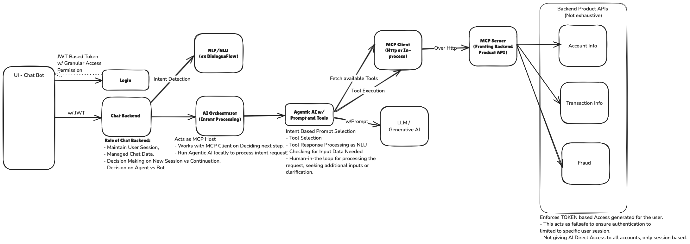
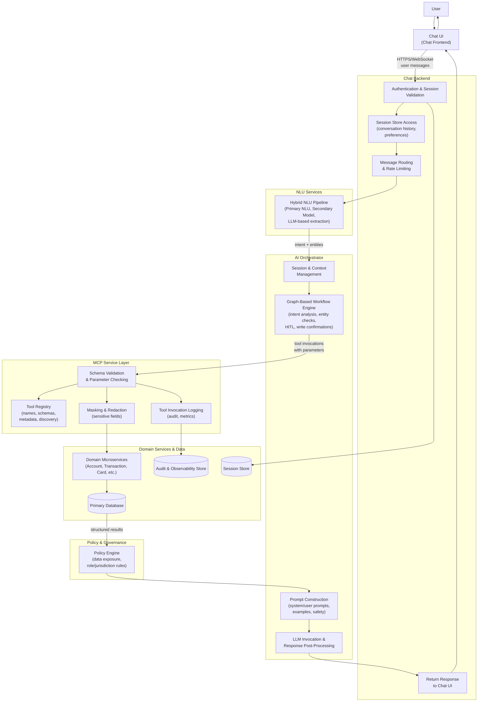
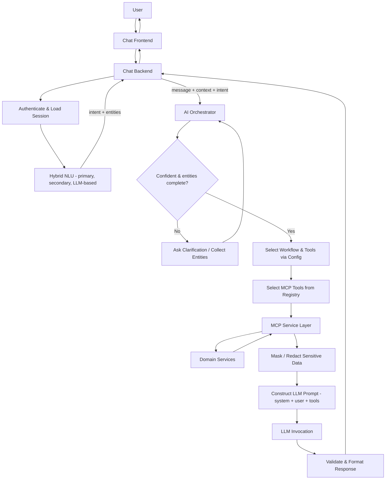
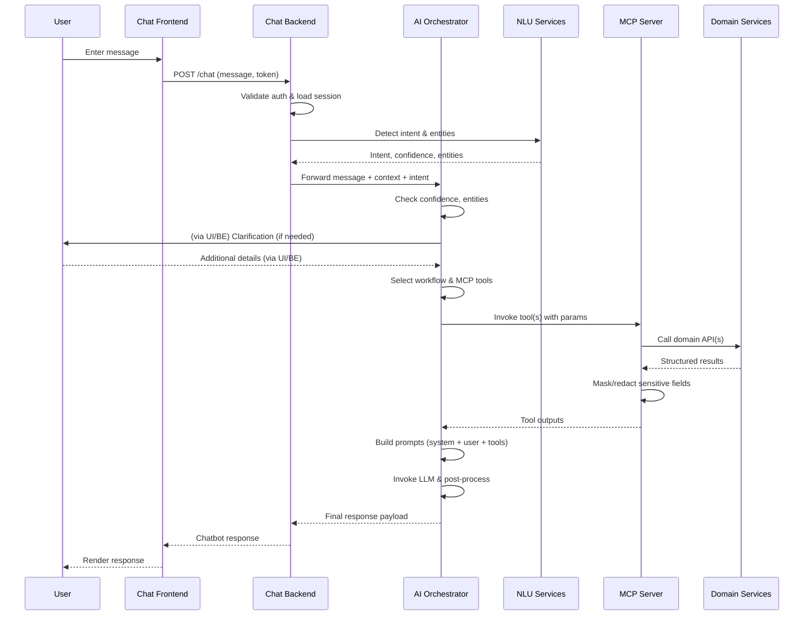
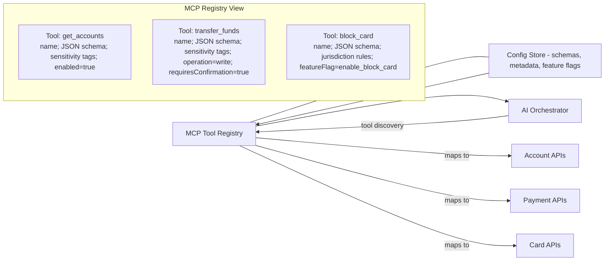
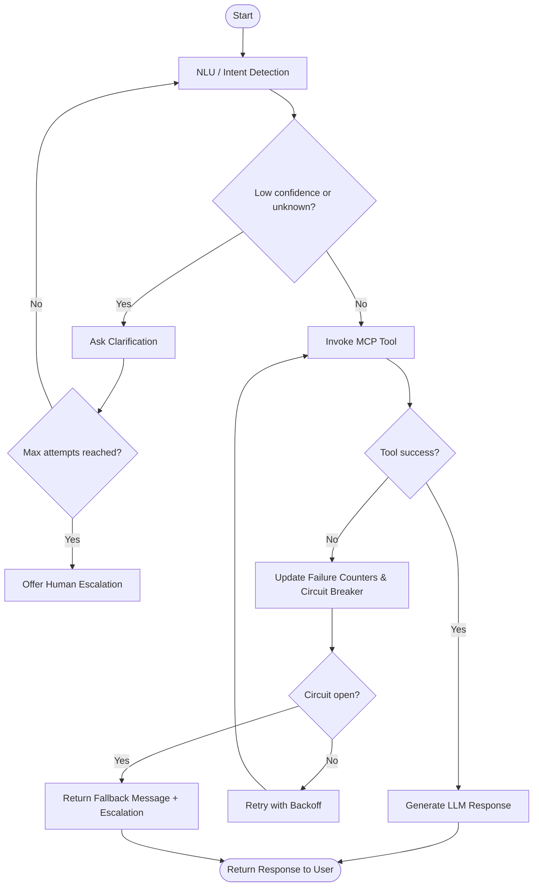
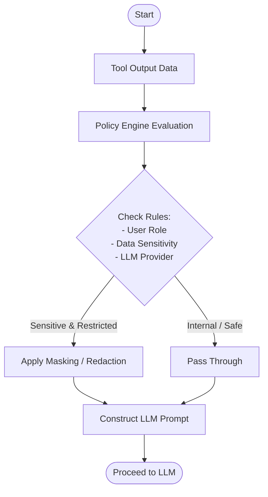

# Systems and Methods for Chatbots Using Agentic AI and Model Context Protocol

## Patent Specification

---

## Title

**SYSTEMS AND METHODS FOR IMPLEMENTING TASK-ORIENTED CHATBOTS USING AUTONOMOUS FULLFILLMENT WORKFLOW USING AGENTIC ARTIFICIAL INTELLIGENCE AND MODEL CONTEXT PROTOCOL**

---

## Field of the Invention

The present invention relates generally to conversational user interfaces and chatbots, and more particularly to systems and methods for implementing task-oriented chatbots using agentic artificial intelligence (AI), generic fulfillment workflow and a standardized tool protocol such as the Model Context Protocol (MCP). The invention is applicable across domains including, but not limited to, financial services, e-commerce, telecommunications, healthcare, and technical support.

---

## Background of the Invention

Chat-based interfaces are increasingly used to provide users with self-service access to products, services, and support across many industries. These are referred to as interactive virtual assistants (IVAs) or chatbots. Conventional chatbot architectures commonly rely on rigid natural language understanding (NLU) pipelines and tightly coupled integrations between front-end interfaces, back-end services, and intent-specific business logic.

In typical systems, the chat frontend is directly coupled to backend APIs and domain-specific intent handlers. Adding new capabilities (for example, a new type of account inquiry in banking, or a new order status query in e-commerce) often requires simultaneous updates to multiple components, including NLU training data, intent classification models, backend service integrations, and response formatting logic. This tight coupling results in high initial implementation cost, substantial operational complexity, and slow adaptation to changing products, regulations, and customer expectations.

Conventional chatbots also struggle with conversational flexibility. Intent libraries must be extensively pre-defined, and unexpected user phrasing or multi-intent queries frequently cause misclassification or fallback behaviors. Many systems lack robust conversational memory, forcing users to repeat information. Additionally, sensitive data (e.g., financial, medical, or personally identifiable information) must be carefully managed to avoid leakage into logs or external AI models, creating significant security and compliance challenges.

Recent advances in large language models (LLMs) and agentic AI provide new opportunities for building more flexible, context-aware chatbots. However, naïvely connecting LLMs directly to core APIs without clear boundaries and control (for example, letting an LLM construct arbitrary API calls) can introduce security, compliance, and reliability risks. There is therefore a need for an architecture that leverages agentic AI and autonomous agent capabilities while maintaining strict control over tools, data access, and execution, and that decouples conversational orchestration from domain-specific business logic.

Many existing LLM-based agent frameworks provide generic "tools" or function-calling interfaces but do not prescribe a domain-agnostic, policy-aware architecture for separating conversational workflows from business logic. In such systems, LLMs may directly plan and invoke arbitrary tools or APIs, with limited schema validation, limited masking of sensitive outputs before inclusion in prompts, and little support for configuration-driven reuse of workflows across domains. As a result, conventional approaches can be difficult to govern, may require code changes to introduce new capabilities, and can expose organizations to increased security and compliance risk.

---

## Summary of the Invention

In one aspect, the invention provides a system and method for implementing task-oriented chatbots using an agentic AI orchestrator together with a standardized tool interface layer, such as a Model Context Protocol (MCP) server, to access domain services. The architecture decouples the chat frontend, AI orchestration, NLU, and domain microservices through well-defined interfaces, thereby reducing integration complexity, improving maintainability, and enabling rapid introduction of new conversational capabilities.

Unlike generic LLM agent patterns that allow models to construct and invoke tools in an ad hoc fashion, the disclosed system constrains all tool access through an MCP-compliant service layer with schema-based validation, masking and redaction policies, and policy-driven governance, and drives orchestration behavior from configuration rather than code. A graph-based AI orchestrator coordinates a hybrid NLU pipeline, human-in-the-loop entity completion, and controlled tool execution, enabling autonomous, domain-agnostic workflows that can be safely extended to new domains by updating configuration artifacts rather than rewriting orchestrator logic.

According to one embodiment, the system includes:

- A chat frontend configured to capture user messages and display chatbot responses. Referred as Chat UI.
- An API based chat backend, configured to manage authenticated user sessions, maintain conversation context, and route messages.
- A NLU component that integrates with one or more NLU services with fallback to generative AI based intent detection.
- An AI orchestrator configured to:
  - perform intent analysis and perform specific AI agent workflows to fulfill user requests,
  - perform thorough validation of user input extraction, and based on defined prompts, perform data extraction and human-in-the-loop validation to seek any missing inputs.
  - autonomously execute fulfillment workflows by invoking one or more tools via an MCP-compliant interface, and
  - generate natural language responses using at least one LLM.
  - acts as a MCP client to invoke tools exposed by the MCP server.
- An MCP service layer exposing a plurality of tools corresponding to domain-specific operations (for example, account operations, order management, ticket management, or profile management), with schema-based parameter validation.
- One or more backend domain services providing the underlying business functions, typically implemented as microservices communicating with domain data stores.

In operation, a user message is received at the chat frontend (Chat UI) and forwarded to the chat backend, where authentication and session context are enforced. 

The chat backend is responsible for managing the session, identifying if a new session is established, and managing new intent vs existing intent response. The chat backend handles the management of chat sessions along with detecting a new intent vs responding to an existing intent follow-up questions. The chat backend also responsible for integrating with the NLU services to perform intent detection and then passes the user message with derived intent to the AI orchestrator.

The AI orchestrator then uses the user messages and intent details to trigger a predefined and generic agentic workflow to fulfill user requests. This involves selecting the predefined prompt to fulfill the request, which can be a simple mapping between intent and prompt. Defining well-written prompts is a key aspect of the system function. Prompts define all the required inputs and utilize LLM-based function calling to fetch data needed via MCP-based tool calling. Based on the detected intent and extracted entities, the AI orchestrator selects one or more MCP tools to execute. The tools are invoked via the MCP service layer, which validates parameters and invokes the corresponding domain microservices. A key aspect of autonomous execution is to define workflows with processing predefined prompts, and key capabilities include data extraction from user input, identifying missing inputs, and performing human-in-the-loop validation to obtain any missing inputs from the user before proceeding with tool execution. All of these are implemented in a generic manner, decoupled from domain-specific logic so that new capabilities can be added rapidly by defining new prompts and mapping them to existing or new tools. This key capability is the crux of the invention to enable autonomous execution of user requests in a generic manner with domain-agnostic design.


The microservices return structured data that may be masked or redacted to avoid exposing sensitive information to the LLM. The AI orchestrator then constructs prompts including system instructions, safety constraints, contextual data, and user messages, and invokes the LLM to generate a natural language response that is returned to the user.

In some embodiments, the system additionally implements observability and control features, including structured logging of tool calls with correlation identifiers, monitoring of intent accuracy and action success rates, circuit breakers, and fallback behaviors to human agents upon repeated errors or low-confidence conditions.

The architecture is domain-agnostic and can be applied to financial use cases (for example, account inquiries, transaction management, and card services) as well as to other domains such as e-commerce, telecommunications, and healthcare—generally, any customer-servicing workflow that can be automated via a chatbot. In one illustrative embodiment, a banking domain is used to demonstrate account inquiries, transaction management, card services, and secure operations; however, the underlying mechanisms are not limited to banking.

In another aspect, the invention provides a method of operating a task-oriented chatbot comprising receiving a user query, determining an intent, selecting at least one MCP tool based on the intent, invoking the tool to perform a domain-specific function, and generating a natural language response using an LLM based on tool outputs and conversation context.

---

## High-Level Overview of the System Architecture

- **FIG. 1** is a block diagram of a system architecture for a task-oriented chatbot using an AI orchestrator and a Model Context Protocol service layer.





- **FIG. 2** is a flow diagram illustrating a method for processing a user request using intent detection, tool execution via MCP, and LLM-based response generation.



- **FIG. 3** is a sequence diagram illustrating interactions among the chat frontend, chat backend, AI orchestrator, NLU service, MCP server, and domain microservices for a sample request.



- **FIG. 4** is a schematic diagram of an MCP tool registry and its relationship to underlying domain service APIs.



- **FIG. 5** is a flow diagram illustrating error handling, circuit breaking, and human escalation for low-confidence or failed tool executions.



- **FIG. 6** is a flow diagram illustrating the policy engine workflow for data governance, masking, and redaction of sensitive tool outputs.


---

## Detailed Description of the Invention

### System Overview

In one embodiment, the system comprises:

#### 1. Chat Frontend

A user interface (web, mobile, or other client) presenting a chat interface that:
- Accepts user input in the form of text messages or other modalities (e.g., voice, images).
- Renders messages in a conversational thread, distinguishing between user and assistant messages.
- Communicates with the chat backend over secure channels (e.g., HTTPS, WebSocket).
- Maintains session authentication tokens (e.g., JWT) in secure storage (e.g., secure cookies, local storage with appropriate protections).

#### 2. Chat Backend

A server-side component that:
- Receives incoming messages from the chat frontend and validates authentication tokens.
- Associates each user message with a conversation identifier (for grouping turns within a single conversation) and a session identifier (for grouping conversations by user and session).
- Stores or retrieves conversation history and session metadata from a session store (e.g., Redis, database).
- Implements rate limiting and abuse detection to prevent misuse.
- Invokes one or more NLU services to perform intent detection and entity extraction using a hybrid approach (primary NLU, secondary model, LLM-based fallback).
- Routes validated messages along with detected intent and entities to the AI orchestrator.
- Receives responses from the AI orchestrator and returns them to the chat frontend.

#### 3. AI Orchestrator

A workflow engine (e.g., based on graph-based orchestration frameworks like LangGraph) that:
- Receives user messages, session context (e.g., conversation history, user roles, preferences), and detected intent with entities from the chat backend.
- Applies decision logic based on the detected intent, confidence score, and entity availability to determine whether to:
  - Request additional clarification from the user if confidence is low or entities are missing.
  - Check authorization constraints and domain-specific business rules.
  - Request explicit user confirmation for write operations.
  - Proceed to tool execution.
- Selects one or more tools from the MCP registry that correspond to the detected intent.
- Invokes the tools via the MCP service layer, optionally in parallel when independent.
- Receives structured results from the tools.
- Constructs one or more prompts for the LLM, incorporating:
  - A system prompt defining the assistant's role, domain, safety constraints, and behavioral guidelines.
  - A user prompt containing the latest user message, detected intent and confidence, relevant context (e.g., user preferences, prior actions in the conversation), and tool outputs.
  - Optional few-shot examples demonstrating desired response format or reasoning.
- Invokes at least one LLM (e.g., GPT-4, Claude, or similar) to generate a natural language response based on the constructed prompts.
- Applies post-processing to the LLM output, including:
  - Validation of response content (e.g., ensuring no sensitive data is inadvertently exposed).
  - Formatting (e.g., breaking into paragraphs, adding structured elements).
  - Inclusion of suggested next actions or follow-up options.
- Returns the processed response to the chat backend.

#### 4. NLU Services

One or more NLU components that determine user intent and extract entities. In one embodiment, a hybrid approach is used:

- **Primary NLU Engine**: A hosted or on-premises NLU service (e.g., Google Dialogflow, AWS Lex, Microsoft LUIS, or open-source Rasa) trained on domain-specific intents and configured to detect a set of known intents with high confidence.
- **Secondary Domain-Specific Model**: A custom machine learning model (e.g., a fine-tuned transformer or SVM) trained specifically on domain examples and edge cases to provide additional accuracy and domain awareness.
- **LLM-Based Function Calling**: A configuration that instructs an LLM to extract intent and entities from a user message by calling a system function with appropriate parameters. This component is used when primary and secondary engines return low confidence scores or encounter novel phrasings.

The chat backend invokes these NLU components in sequence, accepting results when confidence exceeds a threshold (e.g., 0.70), then forwards the detected intent and entities along with the user message to the AI orchestrator.

#### 5. MCP Service Layer

A protocol-compliant tool server (implementing the Model Context Protocol specification) that:
- Maintains a registry of available tools, each defined by:
  - A unique tool name (e.g., `get_account_balance`, `check_order_status`).
  - A human-readable description of the tool's purpose.
  - A JSON schema specifying required and optional input parameters and their types, validation rules, and constraints.
  - Metadata indicating whether the tool performs a read operation (safe, idempotent) or a write operation (mutating, requiring confirmation).
- Responds to tool-discovery requests from the AI orchestrator, providing a list of available tools and their schemas. This enables dynamic adaptation without code changes.
- Validates incoming tool invocation requests from the AI orchestrator against the declared schema, rejecting calls with invalid or missing parameters before invoking backend services.
- Upon validation, invokes the corresponding backend domain service or data source with the validated parameters.
- Receives results from the backend service.
- Applies masking, redaction, or filtering policies to the results (e.g., hiding full account numbers or sensitive fields) according to configuration.
- Returns the processed results to the AI orchestrator via the MCP protocol.
- Logs all tool invocations, parameters, and results for audit, observability, and continuous improvement.
- MCP Service Layer apply additional policy checks based on user role, and data sensitivity before allowing tool invocation or data exposure. This enforces governance and compliance requirements to ensure account data is only accessed by authorized users and that sensitive data is protected.
- The MCP service layer also normalizes and adjusts payloads to meet data requirements for agentic AI processing, including applying necessary transformations, tokenization, and data minimization before passing data to the AI orchestrator. These adaptations may be required on a case-by-case basis, particularly when integrating with legacy enterprise systems that are not AI-ready or that lack clear, machine-interpretable API specifications.

#### 6. Domain Services Layer

A collection of microservices or application programming interfaces (APIs) corresponding to the target domain. Each domain service implements business logic specific to a domain and communicates with underlying data stores. Examples across domains include:

**Financial Services Domain**:
- Account service: retrieve account metadata, list accounts, retrieve balances.
- Transaction service: retrieve transaction history, retrieve transaction details.
- Transfer service: execute fund transfers, schedule payments, manage recipients.
- Card service: retrieve card details, block or unblock cards, order replacements, activate cards.
- Profile service: retrieve or update customer profile, preferences, and consent.
- Compliance service: check KYC status, detect suspicious transactions, enforce sanctions screening.

**E-Commerce Domain**:
- Product catalog service: search products, retrieve product details.
- Order service: retrieve order status, modify orders, retrieve order history.
- Shipping service: retrieve tracking information, estimate delivery.
- Return service: initiate returns, retrieve return status.
- Inventory service: check stock availability.

These services typically expose APIs (e.g., REST, GraphQL, or gRPC) that implement the core business functions of the target domain.

#### 7. Data Stores and Caches

- **Primary Database**: A relational database (e.g., PostgreSQL) or other persistent store containing domain data (accounts, orders, tickets, etc.), user profiles, and configuration. The chat backend may utilize a dedicated database to store user sessions, conversation history, and metadata. Similarly, the AI Orchestrator may utilize a database or cache for maintaining conversational memory. The specific choice of database technologies is implementation-dependent and adaptable to enterprise standards.
- **Session Store**: An in-memory cache (e.g., Redis) for storing session data, conversation history, and frequently accessed data to improve performance.
- **Audit and Observability Store**: A document database or log store (e.g., MongoDB, Elasticsearch) for immutable audit logs, observability metrics, and historical records.

---

### Domain-Agnostic Design with Illustrative Banking Embodiment

The architecture is designed to be domain-neutral. Each target domain is represented by a set of tools exposed via the MCP service layer and a corresponding set of domain-specific microservices. The same orchestration pattern applies across domains:

| Domain | Example Tools | Example Services | Example Use Case |
|--------|---------------|------------------|-----------------|
| **Financial Services** | `get_accounts`, `get_balance`, `transfer`, `block_card` | Account, Transaction, Card, Compliance | "What's my checking account balance?" |
| **E-Commerce** | `search_products`, `get_order_status`, `create_return` | Product Catalog, Order, Shipping, Return | "Where's my order?" |
| **Technical Support** | `create_ticket`, `search_kb`, `get_ticket_status` | Ticketing, Knowledge Base, Escalation | "How do I reset my password?" |
| **Healthcare** | `schedule_appointment`, `get_prescription`, `retrieve_lab_results` | Appointment, Pharmacy, Lab | "Can I schedule a doctor's appointment?" |
| **Telecommunications** | `check_bill`, `upgrade_plan`, `report_outage` | Billing, Plan Management, Network | "What is my current bill?" |

In the illustrative financial services embodiment, tools such as retrieving account information, retrieving transactions, executing transfers, and managing cards are used to demonstrate account inquiries, transaction management, card services, and secure operations. However, the underlying mechanisms—intent detection, tool selection, parameter validation, response generation—are domain-agnostic and apply equally to any domain.

---

### Authentication and Session Management

In one embodiment, users authenticate via a secure endpoint (e.g., `POST /api/auth/login`) using credentials (e.g., username and password) and, optionally, multi-factor authentication (MFA) via one-time passwords or biometric verification.

Upon successful authentication, the system issues a short-lived JWT (JSON Web Token) containing claims such as:
- User identifier (unique within the system).
- User roles and permissions.
- Token expiration time (e.g., 15–60 minutes).
- Session identifier.

The JWT is transmitted to the chat frontend and stored securely (e.g., in a secure cookie or local storage).

For each incoming chat message, the chat backend extracts and validates the JWT, verifying its signature and expiration. Upon validation, the backend:
- Extracts the user identifier and roles from the JWT.
- Associates the message with a conversation identifier (grouping turns within a single conversation) and a session identifier (grouping conversations by user and session).
- Retrieves or creates session data in the session store, including conversation history, user preferences, and other metadata.
- Forwards the message and context to the AI orchestrator.

The AI orchestrator maintains session context across turns, enabling multi-turn conversations where the bot remembers prior messages, decisions, and user preferences.

---

### Intent Detection and Workflow Selection

When a new user message is received by the chat backend, the system performs intent detection as follows:

1. **Primary NLU Invocation**: The chat backend sends the user message and session context to the primary NLU engine, which returns an intent label, a confidence score, and extracted entities (if applicable).

2. **Confidence Threshold Check**: If the confidence score exceeds a first threshold (e.g., 0.70), the detected intent is accepted and forwarded to the AI orchestrator along with the user message.

3. **Secondary NLU Invocation (if needed)**: If the confidence is between a lower threshold (e.g., 0.50) and the first threshold, the chat backend invokes the secondary, domain-specific NLU model. If this returns a higher confidence, it may be used; otherwise, the system proceeds to the next step.

4. **LLM-Based Function Calling (if needed)**: If both primary and secondary NLUs return low confidence (below the lower threshold), the chat backend constructs a prompt instructing an LLM to extract intent and entities. The LLM is provided with tool function definitions and asked to determine which tool(s) should be invoked. The LLM's response is parsed and used as the detected intent.

5. **Fallback to Clarification or Escalation**: If no NLU component yields sufficient confidence, or if the detected intent is `unknown` or `out_of_scope`, the system generates a clarification question asking the user for more information or offers escalation to a human agent.

Once intent detection is complete, the chat backend forwards the user message, session context, and detected intent with entities to the AI orchestrator for workflow execution.

After receiving the detected intent from the chat backend, the AI orchestrator applies workflow decision logic:

- **Missing Entities**: If the detected intent requires entities that were not extracted (e.g., account type for a balance inquiry), the system generates a follow-up question to collect the missing information.
- **Authorization Check**: The system verifies that the user has permission to perform the action associated with the intent (e.g., checking whether the user can access a specific account).
- **Write vs. Read Operations**: If the intent corresponds to a write operation (e.g., transferring funds, blocking a card, or updating a profile), the system generates a confirmation message and waits for explicit user confirmation before proceeding.
- **Tool Selection**: Based on the intent and extracted entities, the system selects one or more tools from the MCP registry that should be invoked to satisfy the user's request.

### Human-in-the-Loop Entity Completion and Validation

In one embodiment, the system implements a human-in-the-loop entity completion mechanism that uses the structure of the selected intent and associated tool schemas to determine when user input is incomplete or ambiguous, and to obtain clarification before any tool invocation that could result in an incorrect or unauthorized action.

For each recognized intent, the system maintains a machine-readable specification of required and optional entities, including types, allowed value ranges, and domain-specific constraints (for example, that a transfer amount must be positive and that a source and destination account must be distinct). When an intent is detected, the AI orchestrator compares the entities extracted by NLU components against this specification to determine which entities are missing, ambiguous, or invalid.

If one or more entities are missing or ambiguous, the AI orchestrator generates targeted clarification prompts asking the user for exactly the missing information. For example, if a user says, "Transfer $500," and the intent is `transfer.money` but no source or destination account is provided, the AI orchestrator generates questions such as "Which account should we transfer from?" and "Which account should we transfer to?" The AI orchestrator updates the session context with the user’s subsequent responses, re-validates the entity set against the specification, and only proceeds to tool selection once all required entities are present and valid.

In some embodiments, the system further applies domain-specific validation rules before tool invocation. These rules can include checking that an amount is within daily transaction limits, that an account is active, and that the user’s role permits the requested operation. If validation fails, the AI orchestrator explains the reason to the user and may offer alternative actions rather than attempting the tool call.

---

### MCP Tool Selection and Execution

In one embodiment, an intent-to-tool mapping configuration defines, for each recognized intent, one or more tools that should be invoked. For example:

```
Intent: check.balance
Tools: [banking_get_accounts, banking_get_balance]

Intent: transfer.money
Tools: [banking_get_accounts, banking_get_balance, banking_transfer]

Intent: card.block
Tools: [banking_get_cards, banking_block_card]
```

Based on the detected intent and available entities, the AI orchestrator:
- Looks up the intent-to-tool mapping to determine candidate tools.
- Filters tools based on available entities and authorization (e.g., if the user specified a particular account type, only tools relevant to that type are selected).
- Constructs a tool invocation request for each selected tool, including:
  - The tool name.
  - Input parameters matching the tool's JSON schema (extracted from the user message or session context).
  - Optional metadata (e.g., correlation identifier for tracing, user context for authorization).

The MCP service layer receives each tool invocation request and:
- Validates the request parameters against the tool's JSON schema.
- Invokes the corresponding backend domain service with the validated parameters.
- Receives a response from the backend service.
- Applies masking or redaction policies to sensitive fields in the response (e.g., replacing full account numbers with the last four digits, omitting full addresses or government identifiers).
- Returns the processed result to the AI orchestrator.

Tool invocations are logged with all relevant metadata (tool name, parameters, latency, result status, correlation ID) for audit, observability, and continuous improvement.

---

### Data Protection and Privacy

The system implements multiple layers of data protection to ensure sensitive information is not inadvertently exposed to external AI models or logs:

#### Masking and Redaction

Before including tool output in a prompt to the LLM, the system applies masking and redaction policies:
- Full account numbers are masked to show only the last four digits (e.g., `****1234`).
- Full card numbers are masked similarly.
- Full addresses and government identifiers (e.g., SSNs, tax IDs) are omitted from LLM prompts.
- Salaries, detailed financial data, and other sensitive attributes are redacted according to configuration.

#### Tokenization

Sensitive identifiers may be replaced with non-reversible tokens that can be used for subsequent tool calls but do not reveal the underlying data to the LLM or logs.

#### Audit Logging

All accesses to sensitive data are logged in a separate audit trail, including:
- User and timestamp.
- Data accessed.
- Purpose (e.g., tool execution, compliance check).
- Authorized role.

Audit logs are stored in a protected store and retained according to compliance requirements (e.g., 7 years for financial services).

#### Role-Based Access Control

Tools and backend services enforce role-based access control, ensuring that only authorized users can access sensitive data or perform certain operations. Authorization checks are performed at the backend service layer, not in the AI orchestrator or LLM.

### Policy Engine for Data Protection and Tool Governance

In one embodiment, the system includes a policy engine that governs which data may be exposed to large language models, which tools may be invoked for a given user or context, and how tool outputs must be transformed before inclusion in any LLM prompt.

The policy engine evaluates rules expressed over attributes such as:
- User role, segment, and jurisdiction.
- Tool identity and operation type (for example, read vs. write).
- Data field sensitivity classifications (for example, public, internal, confidential, regulated).
- Target LLM provider (for example, internal model vs. external hosted provider) and its allowed data handling profile.

Tools and backend services annotate output fields with sensitivity metadata or schema tags. Before constructing an LLM prompt, the AI orchestrator submits a policy evaluation request that includes the tool outputs and intended target model. The policy engine returns transformation requirements specifying which fields must be masked, redacted, tokenized, or omitted entirely. The AI orchestrator or MCP service layer then applies these transformations to the tool outputs before they are embedded into prompts.

The same policy mechanism can be used to determine which tools appear as available to a given user or session at runtime. For example, a `block_card` tool may be disabled for users in certain jurisdictions, or enabled only for users with a particular authorization claim. The AI orchestrator receives the set of permitted tools based on policy evaluation and constrains its tool-selection and planning logic accordingly.

---

### LLM Response Generation

The AI orchestrator constructs one or more prompts for the LLM that incorporate:

#### System Prompt

A system prompt that describes:
- The assistant's role and domain (e.g., "You are a banking assistant for SecureBank").
- Specific responsibilities (e.g., "Help customers with account inquiries, transactions, and card management").
- Behavioral guidelines (e.g., "Provide clear, accurate information based on retrieved data").
- Safety constraints and prohibitions:
  - "NEVER share full account numbers or SSNs".
  - "NEVER execute transfers without explicit user confirmation".
  - "NEVER provide financial advice or investment recommendations".
  - "ALWAYS verify user intent before blocking cards or closing accounts".
- List of available tools and their purposes.

#### User Prompt

A user prompt that includes:
- The user's latest message.
- Detected intent and confidence score.
- Extracted entities (e.g., account type, amount, date range).
- Relevant context from the session (e.g., user preferences, prior actions in the conversation).
- Outputs from tool invocations, masked or redacted as appropriate.

#### Few-Shot Examples (Optional)

In some embodiments, the system includes one or more examples of desired response format or reasoning, e.g.:

```
Example:
User: "What's my checking account balance?"
Intent: check.balance
Account Data: [{ accountId: ****1234, type: CHECKING, balance: $2,450.00 }]

Expected Response:
"Your checking account (ending in 1234) has a balance of $2,450.00. 
Would you like to [view transactions] [transfer funds] [something else]?"
```

#### LLM Invocation

The AI orchestrator invokes the LLM (e.g., GPT-4 or Claude) with the constructed prompts, specifying:
- Model name and version.
- Temperature (e.g., 0.7 for balanced determinism and creativity).
- Maximum token limit (e.g., 2000 tokens).
- Tools available for the LLM to call (if using function calling for multi-step reasoning).

#### Response Parsing and Validation

The LLM response is parsed to extract:
- The main text response.
- Any function calls requested by the LLM (if function calling is enabled).
- Structured elements (e.g., suggested actions).

The response is validated to ensure:
- No sensitive data (full account numbers, SSNs, etc.) appears in the response.
- The response is coherent and appropriate for the detected intent.
- Any requested function calls are valid and authorized.

#### Response Formatting

The validated response is formatted for display to the user, including:
- Concise, natural language text.
- Optional rich content (e.g., cards displaying account details, buttons for suggested actions).
- Confidence level, if appropriate (e.g., "I'm about 90% confident that you want to check your balance").
- Suggested next actions (e.g., "Would you like to [view transactions] [transfer funds]?").

---

### Observability, Logging, and Monitoring

The system implements comprehensive observability to track behavior, identify issues, and support continuous improvement:

#### Structured Logging

For each user message processed, the system logs structured data including:
- Timestamp and correlation identifier (unique per message, linking logs across all services).
- User identifier and session identifier.
- User message text (optionally truncated for privacy).
- Detected intent, confidence score, and extracted entities.
- NLU service used and its latency.
- Tools selected and invoked.
- Tool invocation parameters (excluding sensitive data) and latencies.
- Tool invocation results (status, latency, masked data).
- LLM model, prompt tokens, completion tokens, and latency.
- Final response generated.
- User feedback (if any, e.g., thumbs up/down rating).

#### Key Metrics

The system tracks and reports on:
- **Intent Detection Accuracy**: Percentage of correctly detected intents (evaluated via user feedback or manual review).
- **Confidence Scores**: Distribution of confidence scores across detected intents, identifying intents with low confidence that may need additional training or refinement.
- **Tool Success Rate**: Percentage of tool invocations that succeeded vs. failed, identified by tool name and domain.
- **Latency**: Percentiles (p50, p95, p99) of:
  - End-to-end message processing time.
  - Intent detection latency.
  - Tool execution latency.
  - LLM response latency.
- **User Satisfaction**: Ratings, feedback, and engagement metrics (e.g., session length, conversation turns, escalation rate).
- **Error Rates**: Frequency of errors by type (NLU errors, tool execution errors, LLM errors, etc.).

#### Observability Dashboards

The system provides real-time dashboards and reports showing:
- Current and historical metrics.
- Alerts for anomalies (e.g., sudden drop in tool success rate, spike in error rate).
- Breakdown by intent, tool, time of day, user segment, etc.

---

### Error Handling and Fallback Mechanisms

The system implements multi-layered error handling to ensure robustness and a graceful user experience:

#### Low Confidence Handling

If the primary NLU engine returns a confidence score below a first threshold (e.g., 0.70), the system attempts secondary or tertiary NLU components. If all components return low confidence, the system generates a clarification question asking the user to rephrase or provide more details.

After multiple failed clarifications (e.g., 3 attempts), the system offers to escalate the conversation to a human agent.

#### Tool Execution Failures

If a tool invocation fails (e.g., backend service returns an error), the system:
- Logs the failure with details (error code, message, timestamp).
- Attempts to retry the tool call with exponential backoff (e.g., 100ms, 500ms, 2000ms between retries).
- If retries are exhausted, generates a user-facing message indicating a temporary issue and offering escalation to a human agent.

#### Circuit Breaker Pattern

To prevent cascading failures when a backend service is experiencing outages or degradation, the system implements a circuit breaker:
- A counter tracks consecutive failures for each backend service.
- When the failure count exceeds a threshold (e.g., 5 consecutive failures), the circuit opens and further requests to that service are immediately rejected.
- Requests are retried at intervals (e.g., every 60 seconds) to detect when the service recovers.
- Upon successful recovery, the circuit closes and normal operation resumes.

#### Fallback Messages

When errors occur, the system provides user-friendly fallback messages, such as:
- "I'm having trouble accessing that information right now. Please try again in a moment."
- "I'm experiencing technical difficulties. A human agent will assist you shortly."

The system then routes the conversation to a human agent or a simpler fallback chatbot if available.

#### Escalation to Human Agents

Conversations are escalated to human agents when:
- Low-confidence intent detection persists after clarification attempts.
- Tool execution fails repeatedly.
- The user explicitly requests an agent (e.g., "I want to speak to someone").
- The detected intent is flagged as sensitive or out-of-scope (e.g., disputes, complaints, or features not yet implemented).
- The conversation has not reached resolution after a certain duration or number of turns.

Upon escalation, the system provides the human agent with full conversation history, detected intents, extracted context, and any relevant tool outputs to enable efficient handoff.

---

### Multi-Turn Conversation and Context Management

The chat backend maintains conversation history and session state, allowing the AI orchestrator to provide natural multi-turn conversations:

- **Conversation History**: The system stores and retrieves a sliding window of prior messages (e.g., the last 10–20 turns) from the session store.
- **Context Enrichment**: Prior messages are included in prompts to the LLM, enabling the LLM to refer back to earlier statements and understand evolving user intent.
- **Entity Persistence**: Entities extracted in earlier turns (e.g., account type, date range) are stored in session context and reused in subsequent turns if applicable.
- **User Preferences**: User-specific preferences (e.g., preferred language, communication style) are stored and applied across turns.

---

### Configuration and Extensibility

The system is designed for extensibility and domain-agnostic configuration:

#### Intent-to-Tool Mapping Configuration

An intent-to-tool mapping configuration (e.g., a JSON or YAML file) defines:
```json
{
  "intents": {
    "check.balance": {
      "tools": ["domain_get_accounts", "domain_get_balance"],
      "requiresConfirmation": false,
      "description": "Retrieve account balance"
    },
    "transfer.money": {
      "tools": ["domain_get_accounts", "domain_transfer"],
      "requiresConfirmation": true,
      "description": "Execute fund transfer"
    }
  }
}
```

#### Prompt Template Configuration

Prompt templates can be stored in configuration files and versioned:
```
system_prompt_banking_v1:
  "You are a banking assistant for SecureBank. Help customers with account inquiries, transactions, and card management. Never share full account numbers or SSNs."

user_prompt_balance_inquiry_v1:
  "The user asked: {userMessage}. Their checking account shows: {accountData}. Provide a clear response."
```

#### Tool Registry Configuration

The MCP tool registry can be configured to expose or hide tools based on feature flags, user roles, or gradual rollout strategies:
```json
{
  "tools": [
    {
      "name": "domain_get_accounts",
      "description": "Retrieve user accounts",
      "enabled": true,
      "schema": { ... }
    },
    {
      "name": "domain_experimental_feature",
      "description": "New experimental feature",
      "enabled": false,
      "featureFlagKey": "enable_experimental_X"
    }
  ]
}
```

### Configuration-Driven Domain Specialization

In one embodiment, the system achieves domain-agnostic behavior by treating domain details as configuration rather than code. The AI orchestrator is implemented as a generic workflow engine that reads intent definitions, tool mappings, prompt templates, and validation rules from configuration artifacts (for example, JSON, YAML, or database-backed configuration), such that introducing a new domain or capability does not require changes to orchestrator source code.

For a given deployment, domain experts or developers define:
- A set of intents and their descriptions.
- Mappings from intents to one or more MCP tools, including whether each intent corresponds to a read or write operation and what confirmation semantics apply.
- Prompt templates used for system and user prompts, including placeholders for entities, tool outputs, and safety instructions.
- Entity specifications and validation rules for each intent.

The AI orchestrator loads these configurations at startup or on a scheduled basis and interprets them to construct workflows. For example, adding support for a new healthcare scheduling intent may consist of adding a new intent label, mapping it to existing scheduling tools exposed via the MCP layer, and defining appropriate prompt templates and validation rules. No changes to the orchestrator code are required, which enables rapid extension to new domains and use cases.

In some embodiments, configuration changes can be safely rolled out using versioned configurations and feature flags, allowing new intents or tools to be enabled for a subset of users or sessions before global rollout.

---

## Claims

### Preamble

The following claims define the scope of the invention. Independent claims are numbered first, followed by dependent claims. The invention is not limited to the specific embodiments described but extends to all systems and methods meeting the claim language.

---

### Claims

**1. A system for providing task-oriented conversational services**, comprising:

- a chat frontend configured to receive user messages and present chatbot responses;
- a chat backend configured to authenticate users, manage chat sessions, invoke at least one natural language understanding (NLU) component to determine user intent and entities, and forward user messages with detected intent and associated session context;
- an artificial intelligence (AI) orchestrator configured to:
  - (i) receive user messages, detected intent, entities, and session context from the chat backend;
  - (ii) validate entity completeness and request clarification from users when entities are missing or ambiguous;
  - (iii) select at least one tool corresponding to the user intent from a tool registry;
  - (iv) invoke the at least one tool via a Model Context Protocol (MCP) service layer; and
  - (v) generate a natural language response based on outputs from the at least one tool and the user message using a large language model (LLM);
- an MCP service layer configured to expose the at least one tool to the AI orchestrator via a standardized protocol, validate input parameters against a schema, and invoke one or more backend domain services; and
- a plurality of backend domain services configured to perform domain-specific functions,

wherein conversational logic executed by the AI orchestrator is decoupled from business logic implemented by the backend domain services.

**2. The system of claim 1**, wherein the domain-specific functions comprise at least one of: account management, order management, ticket management, profile management, subscription management, or device management.

**3. The system of claim 1**, wherein the chat backend is further configured to invoke a plurality of NLU components in a hybrid sequence, including:
- a first NLU engine configured to detect known intents;
- a second, domain-specific NLU model configured to refine or supplement the detected intent; and
- an LLM-based function-calling component configured to determine intent and entities when the first NLU engine and the second NLU model return confidence scores below a threshold.

**4. The system of claim 1**, wherein the tool registry exposed by the MCP service layer comprises a plurality of tools each described by:
- a name,
- a textual description, and
- a JSON schema defining required and optional input parameters,

and wherein the MCP service layer is configured to reject tool invocations that fail schema validation.

**5. The system of claim 1**, wherein the MCP service layer is configured to apply masking or redaction policies to sensitive fields in tool outputs prior to providing the outputs to the AI orchestrator for inclusion in prompts to the LLM.

**6. The system of claim 1**, wherein the AI orchestrator is implemented using a graph-based workflow engine defining:
- a plurality of nodes including at least an intent analysis node, a tool execution node, and a response generation node, and
- a plurality of edges defining execution order between the plurality of nodes.

**7. The system of claim 1**, wherein the chat backend is further configured to:
- associate each user message with a conversation identifier and a session identifier, and
- store conversation history in a session store accessible by the AI orchestrator to provide multi-turn conversational context.

**8. The system of claim 1**, further comprising a logging subsystem configured to record, for each processed user message, at least one of:
- a detected intent,
- a confidence score,
- tools invoked,
- latencies for NLU, tool execution, and LLM calls, and
- a correlation identifier linking logs across services.

**9. The system of claim 1**, wherein the AI orchestrator is further configured to:
- determine that a selected intent corresponds to a write operation that modifies state in at least one backend domain service, and
- in response, generate a confirmation message and require explicit user confirmation before invoking the at least one tool associated with the write operation.

**10. The system of claim 1**, wherein the AI orchestrator is further configured to escalate a conversation to a human agent upon detecting at least one of:
- a sequence of low-confidence intents exceeding a predetermined count,
- repeated tool failures,
- a user request for escalation, or
- a compliance-sensitive intent (e.g., fraud dispute or complaint).

**11. The system of claim 1**, wherein the backend domain services comprise a financial services domain, and wherein the domain-specific functions include at least one of:
- retrieving financial account information,
- retrieving transaction history,
- executing fund transfers, or
- managing payment cards.

**12. The system of claim 11**, wherein the MCP service layer exposes tools configured to:
- retrieve financial accounts,
- retrieve financial transactions,
- execute fund transfers, and
- block or replace payment cards,

and wherein outputs from such tools are masked to reveal only partial account or card numbers to the LLM.

**13. The system of claim 1**, wherein the backend domain services comprise an e-commerce domain, and wherein the domain-specific functions include at least one of:
- searching products,
- retrieving product details,
- checking order status,
- modifying orders, or
- initiating returns.

**14. The system of claim 1**, wherein the backend domain services comprise a support or ticketing domain, and wherein the domain-specific functions include at least one of:
- creating support tickets,
- retrieving ticket status,
- searching a knowledge base, or
- escalating to human agents.

**15. The system of claim 1**, wherein the MCP service layer is further configured to support a tool discovery operation through which the AI orchestrator requests and receives a list of currently available tools and their respective input schemas, enabling dynamic adaptation of workflows without modifying AI orchestrator code.

**16. The system of claim 1**, wherein the AI orchestrator is further configured to:
- maintain multiple prompt templates associated with a given intent, and
- select among the multiple prompt templates according to an experiment configuration for A/B testing based on user identifiers or sessions,

and wherein metrics collected during operation are used to update the experiment configuration.

**17. A computer-implemented method for providing task-oriented conversational services**, comprising:

- receiving, at a chat backend, a user message from a chat frontend together with authentication information;
- validating the authentication information and associating the user message with a session context;
- determining, by the chat backend, a user intent and one or more entities using at least one natural language understanding (NLU) component;
- sending the user message, detected intent, entities, and session context to an AI orchestrator;
- validating, by the AI orchestrator, that required entities are present and requesting clarification from the user if entities are missing or ambiguous;
- selecting, based on the user intent, at least one tool from a plurality of tools exposed via a Model Context Protocol (MCP) service layer;
- invoking, via the MCP service layer, the at least one tool to perform a domain-specific function using one or more backend domain services;
- receiving, at the AI orchestrator, output data from the at least one tool;
- constructing a prompt including at least the user message, the output data, and one or more safety instructions;
- invoking a large language model using the constructed prompt to generate a natural language response; and
- returning the natural language response to the chat frontend for display to the user.

**18. The method of claim 17**, further comprising masking or redacting, prior to constructing the prompt, one or more sensitive fields in the output data according to domain-specific policies to prevent exposure of full account numbers, full card numbers, or government identifiers to the large language model.

**19. The method of claim 17**, further comprising:
- determining that a confidence score associated with the user intent is below a threshold, and
- in response, transmitting a clarification question to the chat frontend requesting additional information from the user.

**20. The method of claim 17**, wherein selecting the at least one tool comprises:
- consulting a configuration mapping from intent labels to sets of tools, and
- determining a subset of tools based on available entities and authorization data associated with the session context.

**21. The method of claim 17**, further comprising, in response to detecting that the user intent corresponds to a write operation:
- generating a confirmation message describing the operation and its impact;
- transmitting the confirmation message to the user; and
- proceeding to invoke the at least one tool only upon receiving an explicit confirmation input from the user.

**22. The method of claim 17**, further comprising logging, for each invocation of the at least one tool:
- the tool name,
- invocation time,
- latency,
- result status, and
- a correlation identifier linking the invocation with the user message.

**23. The method of claim 17**, further comprising:
- detecting repeated failures or timeouts when invoking the at least one tool,
- opening a circuit breaker condition in which further invocations of one or more affected backend domain services are temporarily suspended, and
- providing the user with a fallback message or routing to a human agent.

**24. The method of claim 17**, further comprising:
- maintaining conversation history in a session store,
- including relevant prior messages from the conversation history in the constructed prompt to provide multi-turn conversational context.

**25. The method of claim 17**, wherein determining a user intent comprises:
- invoking, by the chat backend, a first NLU engine and receiving a confidence score;
- if the confidence score is above a first threshold, accepting the detected intent;
- if the confidence score is below the first threshold, invoking a second, domain-specific NLU model; and
- if the second NLU model returns a low confidence score, invoking an LLM-based function-calling component to extract intent and entities.

**26. A non-transitory computer-readable medium** storing instructions that, when executed by one or more processors of an AI orchestration system in communication with a chat backend, an MCP service layer, and a plurality of domain microservices, cause the AI orchestration system to perform the method of any of claims 17–25.

**27. The method of claim 17**, wherein the domain-specific function is a financial services function, and the method further comprises:
- retrieving financial account information,
- retrieving transaction history,
- executing fund transfers, or
- managing payment cards.

**28. The method of claim 17**, wherein the domain-specific function is an e-commerce function, and the method further comprises:
- searching for products,
- checking order status,
- modifying orders, or
- initiating returns.

**29. The method of claim 17**, wherein the domain-specific function is a support or ticketing function, and the method further comprises:
- creating support tickets,
- retrieving ticket status,
- searching a knowledge base, or
- escalating to human agents.

**30. The system of claim 1**, wherein the AI orchestrator further implements a workflow engine comprising:
- a state graph defining a plurality of states representing workflow stages (e.g., intent detection, tool selection, tool execution, response generation),
- transitions between states triggered by events or conditions, and
- checkpoint mechanisms enabling the workflow to resume from saved states if interrupted.

**31. The system of claim 1**, wherein the AI orchestrator is further configured to:
- determine, based on a schema associated with the selected intent, that one or more required entities are missing or ambiguous;
- generate at least one clarification message requesting the missing or disambiguating information from the user; and
- update a session context with user responses and resume tool selection and invocation once all required entities are present and valid.

**32. The system of claim 1**, further comprising a policy engine configured to:
- classify fields in tool outputs according to sensitivity levels; and
- determine, prior to construction of a prompt for the large language model, one or more transformations to be applied to the tool outputs, the transformations including at least one of masking, redaction, tokenization, or omission of sensitive fields.

**33. The system of claim 1**, wherein the MCP service layer is further configured to:
- provide, responsive to a discovery request from the AI orchestrator, a registry of tools that are currently enabled for a given user or session context, including respective input schemas and sensitivity metadata; and
- hide or disable tools based on feature flags, user roles, or jurisdictional constraints,

and wherein the AI orchestrator limits tool selection to tools indicated as enabled in the registry.

**34. The method of claim 17**, further comprising:
- determining, based on an entity specification associated with the user intent, that one or more required entities are missing or ambiguous;
- transmitting at least one clarification question to the chat frontend requesting the missing or disambiguating information; and
- upon receiving user responses, updating the session context and proceeding with tool selection and invocation when the entity specification is satisfied.

**35. The method of claim 17**, further comprising:
- evaluating, by a policy engine, one or more rules over the output data from the at least one tool and over metadata associated with a target large language model; and
- in response to the evaluation, applying at least one of masking, redaction, tokenization, or omission to sensitive fields in the output data before including the output data in the constructed prompt.

---

## Abstract

A system and method for implementing task-oriented chatbots using agentic artificial intelligence and the Model Context Protocol. The system decouples conversational logic (frontend, AI orchestrator, NLU) from domain-specific business logic (backend services) through a standardized tool interface layer. An AI orchestrator determines user intent, selects tools via MCP, invokes backend services, and generates natural language responses using an LLM. The architecture is domain-agnostic and applicable across financial services, e-commerce, support, healthcare, and other domains. Extensive observability, error handling, and multi-turn conversation support ensure robust, scalable, and maintainable conversational experiences.

---

## Document Information

**Title:** Systems and Methods for Chatbots Using Agentic AI and Model Context Protocol  
**Version:** 1.0 (Patent Specification Format)  
**Format:** Markdown  
**Prepared by:** Innovation Team  
**Date:** December 5, 2025

---

*End of Patent Specification*

